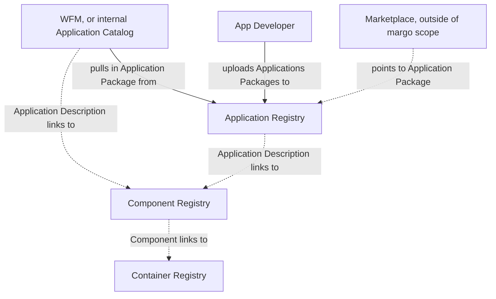
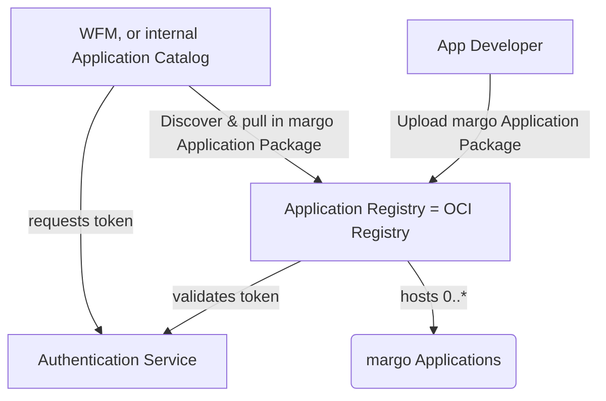
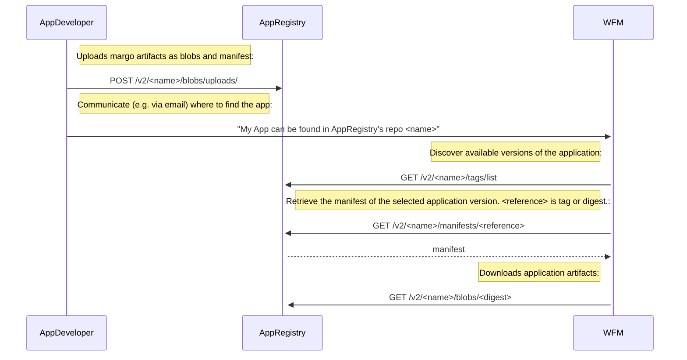

# Specification Update Proposal

## Owner

[@arne-broering](https://github.com/arne-broering)

## Summary

Instead of using Git to provide an application to WFM, a REST API is used - the well-established [OCI Registry API (v1.1.0)](https://github.com/opencontainers/distribution-spec/blob/v1.1.0/spec.md) for digital artifact distribution is used. Re-utilizing OCI Registries offers the benefit of leveraging available libraries and tools for registries and clients (e.g., [oras](https://oras.land/) (OCI Registry as Storage) as a client, and [Docker Registry](https://github.com/distribution/distribution), [Nexus](https://www.sonatype.com/products/nexus-repository) or [Harbor](https://github.com/goharbor/harbor) as registries).

Please find [here](https://github.com/margo/app-package-definition-wg/blob/main/application-registry-example/app_registry_as_oci_registry.md) a tutorial that describes how to use an OCI Registry as a margo Application Registry.

## Reason for proposal

This SUP relates to  [feature 89](https://github.com/margo/specification/issues/89), which addresses the need for Margo to prescribe a way for App developers to host and securely provide access to application packages and application description files.

The margo [specification currently recommends Git](https://specification.margo.org/app-interoperability/workload-orch-to-app-reg-interaction/) for application distribution, but there are several reasons against this:

1. Git is an industry standard but not a specification so there is no way to implement compliance testing based on Git. It also means the Git implementation could change at any point. This proposal addresses this concern by using a well-defined specification with clear compliance requirements.
1. Since Git is not based on a specification this proposal references an established specification. Vendors have the freedom to choose whichever implementation approach they wish to comply with the Margo specification.
1. Alignment with the currently ongoing definition of a REST API for the desired state using the same technology as proposed here.

## Requirements alignment acknowledgement

This proposal addresses [feature 89](https://github.com/margo/specification/issues/89):

1. Define standard interface
1. Define security aspects of interface and responsibility
1. Define how the WFM "onboards" to the description storage location
1. Reference implementation utilizing open-source components and example security components.

## Technical proposal

This proposal recommends the [OCI Registry API specification version 1.1.0](https://github.com/opencontainers/distribution-spec/blob/v1.1.0/spec.md) (henceforth abbreviated as "OCI-spec") to standardize how margo applications are provided to the Workload Flow Manager (WFM). 

### Re-cap

(as already efined in the [margo specification](https://specification.margo.org/margo-overview/software-composition))

An `Application Package` is a folder with a Margo-defined structure comprising the software application. This Application Package contains: A margo-specific Application Description defining the composition of one or more Components. Application packages may contain additional resources such as files of icons, license(s), or release notes.

`Application Package` consists of:
* Application Description: YAML file following the [margo-defined](https://specification.margo.org/app-interoperability/application-package-definition/) structure and format.
* Application resources: icons, licenses, configuration files

`Components` are linked in the Application Description document, are deployable as `workloads`, and are provided in a Margo-supported way, e.g. as `Helm Charts` or `Compose Archives`. 

While `Application Registries` store Application Descriptions and their associated resources, `Component Registries` store Components.




### Proposed Architecture

The proposed architecture consists of:

* Application Registry - Implemented as an `OCI Registry`, it serves [application packages](https://specification.margo.org/app-interoperability/application-package-definition/) defined through `Application Description` files.
* Workload Fleet Manager, or internal Application Catalog, acting as client to pull applications from the registry.
* Authentication Service - Manages access control for the registry.
* App Developer - The actor who uploads the application to the Application Registry.



#### API Endpoints
The Application Catalog / WFM will interact with the Application Registry using standard OCI Registry API endpoints:

* Tags: `/v2/{name}/tags/list` for listing available versions
* Manifest: `/v2/{name}/manifests/{reference}` for retrieving application manifests
* Blob: `/v2/{name}/blobs/{digest}` for downloading artifacts of the application

`<name>` is the namespace of the repository, which needs to be directly communicted by the App Developer to the WFM vendor. It could be for example a combination of the organization's and application's name.

#### Authentication & Authorization
This proposal recommends using OAuth 2.0 for authentication with the following workflow:

* WFM obtains credentials during onboarding
* WFM requests a token from the authentication service
* WFM uses the token for subsequent API calls to the registry
* Application Registry validates the token and enforces access control

Thereby, all communications should use TLS 1.2+ to ensure transport security.

#### Reference Implementation Plan
The reference implementation will utilize:

* Application Registry: Docker Registry (open source OCI Registry)
* Client Library: ORAS (OCI Registry as Storage) client libraries
* Authentication: Keycloak for identity and access management
* Examples: Sample applications and configuration for demonstration

#### Overview of Interactions




### margo 'Application Registry' API Endpoint Definitions towards App Developer (aligned with OCI_spec)

#### Upload a margo Application

First, the application artifacts, as OCI blobs, are uploaded, then the manifest is uploaded.

The upload of blobs and manifests is done via the [end-4a / end-4b](https://github.com/opencontainers/distribution-spec/blob/v1.1.0/spec.md#endpoints) endpoints.

As there are no margo-specific aspects in this, please refer to the OCI_spec regarding the App Developer's interface to the Application Registry. 

### margo 'Application Registry' API Endpoint Definitions towards WFM (aligned with OCI_spec)

#### List margo Application Versions

According to OCI_spec endpoint [end-8a / end-8b](https://github.com/opencontainers/distribution-spec/blob/v1.1.0/spec.md#endpoints).
Use `tags` to discover available versions of a Margo application.
`<name>` is the namespace of the repository, which needs to be directly communicted by the App Developer to the WFM vendor.

`GET /v2/<name>/tags/list`

##### Headers:

```Authorization: Bearer <token>```

##### Query Parameters:

n=<integer> (optional, limits results)
last=<string> (optional, pagination cursor)

#####  Success Response:

200 OK with list of tags

##### Example Response:

```json
{
  "name": "organization/app1",
  "tags": [
    "v1.0.0",
    "v1.1.0",
    "latest"
  ]
}
```

#### Pull margo Application Manifest
According to OCI_spec endpoint [end-3](https://github.com/opencontainers/distribution-spec/blob/v1.1.0/spec.md#endpoints).
Pull a manifest of a specified version of a margo application. The `<reference>` is either a `tag` or a `digest` of a margo application manifest. The `tag` has been discovered via the [listing of app versions](#list-margo-application-versions).
`<name>` is the namespace of the repository, which needs to be directly communicted by the App Developer to the WFM vendor.

``` GET /v2/<name>/manifests/<reference> ```

##### Headers:

* `Authorization: Bearer <token>`
* `Accept: application/vnd.oci.image.manifest.v1+json`

> the `Accept` header may need to be something margo specific. 

##### Success Response:

200 OK with manifest content

Response Headers:

* `Content-Type: application/vnd.oci.image.manifest.v1+json`
* `Docker-Content-Digest: sha256:...`

##### Fail Response:

404 Not Found if manifest doesn't exist

##### Example Response:

In the Margo context, manifests serve as a catalog entry description of an application package within an AppRegistry. It contains references (digests) to all blobs that make up the application. Each application version has its own manifest.

The following response example is a Margo-specific application manifest following the [OCI Image Manifest Specification](https://github.com/opencontainers/image-spec/blob/v1.0.1/manifest.md):

```json
{
  "schemaVersion": 2,
  "mediaType": "application/vnd.oci.image.manifest.v1+json",
  "config": {
    "mediaType": "application/vnd.margo.app.config.v1+json",
    "digest": "sha256:4ba57159935adba4ee78a602d222b9f67f3904316524337d11497bb7844af44e",
    "size": 7682
  },
  "layers": [
    {
      "mediaType": "application/vnd.margo.app.description.v1+json",
      "digest": "sha256:83b25df93eee26731d3e3714578a0f9a46331e95d5fd89dbe88898b857dd41f0",
      "size": 1582,
      "annotations": {
        "org.margo.description": "Application description file"
      }
    },
    {
      "mediaType": "application/vnd.margo.app.icon.v1+json",
      "digest": "sha256:a1a18d95084acdfb9abce3b5e882ef7c675a5210fd8e5b71f7385a346c0387c0",
      "size": 4096,
      "annotations": {
        "org.margo.component": "icon",
        "org.margo.component.name": "app-icon"
      }
    }
  ],
  "annotations": {
    "org.margo.app.version": "1.0.0",
    "org.margo.app.vendor": "Example Organization",
    "org.margo.app.created": "2025-10-01T10:00:00Z",
    "org.margo.app.title": "Example Margo Application",
    "org.margo.app.description": "This is an example Margo application package",
    "org.opencontainers.image.authors": "author@example.com",
    "org.opencontainers.image.vendor": "Example Organization",
    "org.opencontainers.image.version": "1.0.0"
  }
}
```

##### Margo-Specific Media Types

|Media Type|Description|
|----------|----------|
|application/vnd.margo.app.description.v1+json	|Margo application description file|
|application/vnd.margo.app.icon.v1+json	|Icon file|
|...|...|

#### Get margo Application Artifact
According to OCI_spec endpoint [end-2](https://github.com/opencontainers/distribution-spec/blob/v1.1.0/spec.md#endpoints).
Retrieves a margo application artifact by pulling a blob. 
`<digest>` is the blobs digest as listed in the application's manifest that has been [retrieved earlier](#pull-margo-application-manifest).
`<name>` is the namespace of the repository, which needs to be directly communicted by the App Developer to the WFM vendor.


`GET /v2/<name>/blobs/<digest>`

##### Headers:

Authorization: Bearer <token>

##### Success Response:

200 OK with blob content

##### Fail Response:

404 Not Found if blob doesn't exist


## Alternatives considered (optional)

> List any alternative solutions considered while working on the SUP and the reason for not choosing them. If the SUP owner knows that there is a risk of a competing SUP, this section can be used to make their case ahead of any potential votes on why their solution is better.
> 
> Complete as part of Phase 3: SUP Technical Development

## Rejection reason

> If a SUP is rejected, indicate the reason why it was rejected.
> 
> Complete if SUP is rejected at Phase 2: Proposal Creation or Phase 4: Final Decision 
