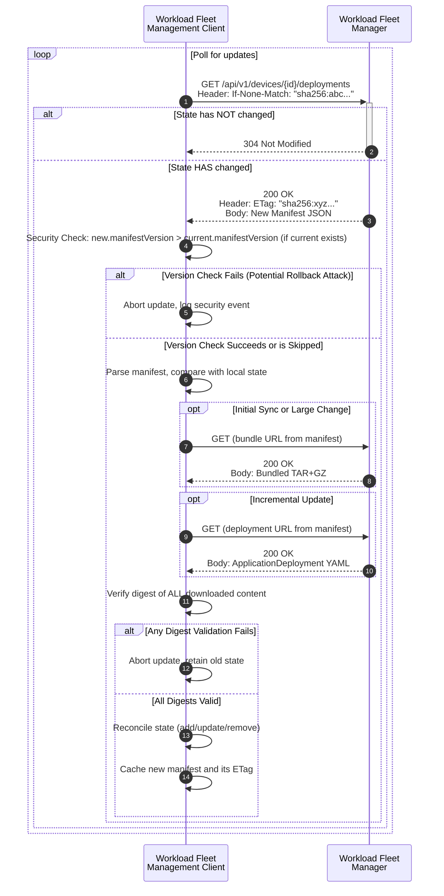

# Specification Update Proposal

## Owner

[@matlec](https://github.com/matlec)

## Summary

This proposal defines a standardized, pull-based protocol for a Margo-compliant **Workload Fleet Management Client** on an **Edge Compute Device** to retrieve its desired state from a **Workload Fleet Manager (WFM)**.

The protocol uses a REST/HTTP API where the client first fetches a lightweight **State Manifest**. This manifest lists all required [`ApplicationDeployment`](https://specification.margo.org/margo-api-reference/workload-api/desired-state-api/desired-state/)s, each identified by a unique `deploymentId`. The client then downloads only the necessary `ApplicationDeployment` YAML files. The protocol is designed to be highly efficient and resilient by using HTTP caching mechanisms ([`ETag`](https://datatracker.ietf.org/doc/html/rfc7232#section-2.3)) for incremental updates and an optional bundle for fast initial synchronization.

## Reason for proposal

The current Margo specification [implies a GitOps pattern for state distribution](https://specification.margo.org/fleet-management/workload/workload-deployment/) but does not define a formal, interoperable protocol for it. Following a decision by the Margo Technical Working Group (TWG) to move away from Git, this proposal defines a suitable replacement.

This SUP directly addresses the concerns raised by the TWG regarding the use of Git:

* **Git is an implementation, not a specification**: This proposal defines a clear API contract based on the universally adopted HTTP specification, which allows for compliance testing.
* **Dictating an implementation**: This proposal defines a protocol, giving vendors the freedom to choose their own implementation technologies for both the client and the WFM.
* **Storage overhead**: This artifact-based approach does not require storing the entire history of changes on the device, significantly reducing the storage footprint compared to a git repository.
* **Client overhead**: The protocol only requires a standard HTTP client, which is ubiquitous and lightweight, avoiding the need for a full git client on resource-constrained devices.
* **Protocol chattiness**: The `ETag` mechanism ensures that polling for updates is extremely efficient, involving minimal data transfer when no changes have occurred.

This SUP is needed to introduce a formal, lightweight, and secure protocol that:

* is firewall-friendly by operating over standard HTTPS (port 443)
* supports low-bandwidth and intermittent connectivity by minimizing data transfer and providing a clear sync path for offline clients
* has a low footprint, requiring only a minimal HTTP client
* decouples the specification from implementation by defining a clear API contract
* establishes a unified and co-located source of truth. The **State Manifest** and the **`ApplicationDeployment` documents** it references are all fetched from a consistent set of API endpoints on the same WFM. This creates a clear security and management boundary and simplifies the client's logic, cleanly separating the delivery of the desired state from the delivery of workload resources (like container images), which may be pulled from different servers or local registries.
* creates a consistent and symmetrical API. All client-WFM interactions, from pulling desired state (`GET`) to pushing status updates (`POST`), follow the same simple, RESTful pattern. This reduces implementation complexity on the client and ensures a coherent API for the entire Margo ecosystem.

## Requirements alignment acknowledgement

This proposal aligns with the core Margo vision of providing a standardized framework for application interoperability at the edge. It directly addresses the need for a scalable and efficient mechanism to distribute and manage workload configurations across a fleet of devices.

* **Applicable Features**: This SUP provides a concrete implementation path for the requirements outlined in issues [margo/specification\#100](https://github.com/margo/specification/issues/100) and [margo/specification\#101](https://github.com/margo/specification/issues/101).

**Authentication and authorization are considered out of scope for this proposal.** It is expected that these APIs will be protected by a common security mechanism defined elsewhere in the Margo specification.

## Technical proposal

The proposed API is designed to be extensible. While this document focuses on workload deployments, the same manifest-based pattern and content-addressable bundles can be reused for future needs, such as distributing device-level configurations (e.g., via a new `/api/v1/devices/{deviceId}/configurations` endpoint). This ensures a consistent and evolvable API architecture.

The following sections describe the API endpoints and a typical workflow.

### API Endpoint Definitions

#### 1\. Retrieve the State Manifest

The client polls this endpoint to retrieve the complete desired state for all workloads assigned to its identity.

* **Endpoint**: `GET /api/v1/devices/{deviceId}/deployments`

  | Parameter      | Type   | Required? | Description |
  | :------------- | :----- | :-------- | :---------- |
  | `{deviceId}` | string | Y | The unique identifier of the **Edge Compute Device** making the request |

* **Headers**:
  * `If-None-Match` (optional): The client **SHOULD** send the `ETag` value of its last successfully synced manifest.
* **Success Responses**:
  * **`200 OK`**: The body contains the new manifest as a JSON object (`Content-Type: application/json`) and the response includes a new `ETag` header.
  * **`304 Not Modified`**: Returned if the `If-None-Match` ETag matches. The body is empty.

#### 2\. Retrieve an Individual Workload Configuration

The client fetches the YAML for a single `ApplicationDeployment`.

* **Endpoint**: `GET /api/v1/devices/{deviceId}/deployments/{deploymentId}`

  | Parameter      | Type   | Required? | Description |
  | :------------- | :----- | :-------- | :---------- |
  | `{deviceId}` | string | Y | The unique identifier of the **Edge Compute Device** making the request |
  | `{deploymentId}` | string | Y | The unique UUID of the `ApplicationDeployment`, corresponding to the [`metadata.annotations.id`](https://specification.margo.org/margo-api-reference/workload-api/desired-state-api/desired-state/#annotations-attributes) field |

* **Success Response**:
  * **`200 OK`**: The response body is the raw `ApplicationDeployment` YAML file (`Content-Type: application/yaml`).

#### 3\. Retrieve a Bundled Workload Configuration

The client fetches a bundle of all `ApplicationDeployment` YAMLs for efficient initial sync.

* **Endpoint**: `GET /api/v1/devices/{deviceId}/bundles/{bundleDigest}`

  | Parameter      | Type   | Required? | Description |
  | :------------- | :----- | :-------- | :---------- |
  | `{deviceId}` | string | Y | The unique identifier of the **Edge Compute Device** making the request |
  | `{bundleDigest}` | string | Y | The full digest string of the bundle, which **MUST** conform to the [Digest Specification](#digest-specification) |

* **Success Response**:
  * **`200 OK`**: The response body is the compressed archive with the `Content-Type` specified in the manifest's `bundle.mediaType`.

### Key Concepts and Specifications

#### ETag Header

The `ETag` is a formal mechanism for cache validation.

* **Format**: The `ETag` value **MUST** be a string formatted as `"<algorithm>:<hex-encoded-hash>"`. The quotes are required per [RFC 7232](https://datatracker.ietf.org/doc/html/rfc7232#section-2.3).
  * Example: `ETag: "sha256:a1b2c3d4e5f6..."`
* **Rationale**: Using a **secure hash of the manifest content** guarantees that the ETag changes *if and only if* the desired state changes. This provides a stateless and perfectly reliable caching mechanism.

#### Digest Specification

Digests are used to verify the integrity of all fetched content. The formal specification of the digest format ensures different client and WFM implementations can create and validate these integrity checks consistently, which is essential for interoperability.

* **Description**: The value of the digest is a string consisting of an algorithm portion and an encoded portion. The algorithm specifies the cryptographic hash function; the encoded portion contains the resulting hash.

* **Grammar**: A digest string **MUST** match the following grammar:

  ```ebnf
  digest      ::= algorithm ":" encoded
  algorithm   ::= algorithm-component (":" algorithm-component)*
  algorithm-component ::= [A-Za-z0-9]+
  encoded     ::= [A-Fa-f0-9]+
  ```
  
  * Example: In the digest string `sha256:a1b2c3d4e5f6...`, the `algorithm` is `sha256` and the `encoded` portion is the hex string `a1b2c3d4e5f6...`.

* **Required Algorithm**: All conformant implementations **MUST** support `sha256`. When the algorithm is `sha256`, the `encoded` portion **MUST** be a hex-encoded string of 64 characters.

* **Validation**: Before using any fetched content, the client **MUST** calculate its digest and verify that it matches the one provided in the manifest. This step provides a defense-in-depth guarantee against data corruption during transit.

#### Manifest Body Structure

The manifest is a JSON object that serves as the source of truth for the device's workload deployments.

```json
{
  "manifestVersion": 101,
  "bundle": {
    "mediaType": "application/vnd.margo.bundle.v1+tar+gzip",
    "digest": "sha256:b5c6d7e8f9...",
    "url": "/api/v1/devices/northstarida.xtapro.k8s.edge/bundles/sha256:b5c6d7e8f9..."
  },
  "deployments": [
    {
      "deploymentId": "a3e2f5dc-912e-494f-8395-52cf3769bc06",
      "applicationId": "com-northstartida-digitron-orchestrator",
      "version": "2.1.1",
      "digest": "sha256:a4e01b2c3d...",
      "url": "/api/v1/devices/northstarida.xtapro.k8s.edge/deployments/a3e2f5dc-912e-494f-8395-52cf3769bc06"
    }
  ]
}
```

| Field | Type | Required? | Description |
| :--- | :--- | :--- | :--- |
| `manifestVersion` | number | Y | A mandatory, monotonically increasing version number (Unsigned 64-bit Integer). The WFM **MUST** ensure this is strictly greater than the previous version. Used to prevent rollback attacks. |
| `bundle` | object | N | Describes a single archive containing all `ApplicationDeployment` documents |
| `bundle.mediaType`| string | Y | The format of the bundle. For `application/vnd.margo.bundle.v1+tar+gzip`, the archive **MUST** contain the individual `ApplicationDeployment` YAML files in its root folder |
| `bundle.digest` | string | Y | The [digest](#digest-specification) of the bundle archive for integrity verification |
| `bundle.url` | string | Y | The endpoint to retrieve the bundle |
| `deployments` | array | Y | A list of all deployment objects for the device |
| `deployments[].deploymentId`| string | Y | The unique UUID from the `ApplicationDeployment`'s [`metadata.annotations.id`](https://specification.margo.org/margo-api-reference/workload-api/desired-state-api/desired-state/#annotations-attributes) |
| `deployments[].applicationId`| string | Y | An identifier from the associated [`ApplicationDescription`](https://specification.margo.org/margo-api-reference/workload-api/application-package-api/application-description/) for context |
| `deployments[].version`| string | Y | An identifier from the associated [`ApplicationDescription`](https://specification.margo.org/margo-api-reference/workload-api/application-package-api/application-description/) for context |
| `deployments[].digest` | string | Y | The [digest](#digest-specification) of the individual `ApplicationDeployment` YAML file |

### Typical Workflow and Client Behavior

1. A **Workload Fleet Management Client** polls the manifest endpoint (`GET /api/v1/devices/{deviceId}/deployments`) provided by the **Workload Fleet Manager** with its cached `ETag`
2. If it receives a `304 Not Modified` response, the process ends until the next poll cycle
3. If it receives a `200 OK` response with a new manifest:

    a.  **Security Check**: The client **MUST** perform a version check before proceeding. Let the newly received manifest be `new_manifest` and the locally stored version be `current_manifest_version`.
        *If the client has no previously stored `current_manifest_version` (e.g., on initial startup or after a state reset), this check is bypassed.
        *   Otherwise, the client **MUST** verify that `new_manifest.manifestVersion > current_manifest_version`. If this condition is false, the client **MUST** reject the update, discard `new_manifest`, and SHOULD log a security event. The process stops.
    b.  **Content Fetch**: If the version check passes, the client determines the most efficient way to fetch content and downloads all required `ApplicationDeployment` YAMLs.
    c.  **Integrity Check**: The client **MUST** validate the digest of all downloaded content *before* proceeding. If any digest is invalid, the client **MUST** abort the update and retain its previous state.
    d.  **State Reconciliation**: Once all content is successfully fetched and validated, the client reconciles its current state with the desired state.
    e.  **Cache Update**: Upon successful reconciliation, the client **MUST** persist the `new_manifest` as its new local source of truth. This action replaces the previous manifest, thereby updating the `current_manifest_version` and the cached `ETag` that will be used in the next poll cycle.

#### State Reconciliation

The client is responsible for comparing the `new_manifest` to its **previously cached manifest** to determine the necessary actions.

* **Adding/Updating:** If a `deploymentId` in the manifest does not exist on the client, or if its `digest` differs from the client's current version, the client **MUST** apply the new `ApplicationDeployment`.
* **Deletion:** If a workload is running on the client but its `deploymentId` is not present in the new manifest's `deployments` array, the client **MUST** remove that workload.

<!-- end list -->



### Security Considerations

This protocol incorporates several mechanisms to ensure a secure state distribution process.

* **Rollback Attack Prevention**: The protocol defends against rollback attacks by using two complementary mechanisms. The `ETag` header provides an efficient method to detect any change, while the mandatory, monotonically increasing `manifestVersion` in the manifest body ensures that any change is a *newer* version of the state. A client **MUST** validate both, rejecting any update that is not strictly newer than its current state.
* **Data Integrity**: The integrity of all distributed content is verifiable. The manifest provides digests for both the optional bundle and each individual `ApplicationDeployment` file. Clients **MUST** validate these digests after download and before application to protect against data corruption during transit.
* **Authentication and Authorization**: This specification intentionally omits authentication and authorization. It is expected that all API endpoints are protected by a robust security framework defined elsewhere in the Margo specification, such as mutual TLS (mTLS) for device identity and OAuth2 for access control.

## Alternatives considered (optional)

* **Git-based Protocol**: Rejected by the Margo TWG for reasons outlined [above](#reason-for-proposal)
* **OCI-based Protocol**: [Another SUP](https://github.com/margo/specification-enhancements/blob/desired_state_from_oci.wip/submitted/sup_desired_state_from_oci.md) details using the OCI distribution specification. This approach is powerful and leverages a rich ecosystem, but introduces higher protocol complexity. The choice between these proposals depends on Margo's strategic priority: the **simplicity and minimalism** of a purpose-built API (this proposal) versus the **ecosystem reuse** offered by OCI.
