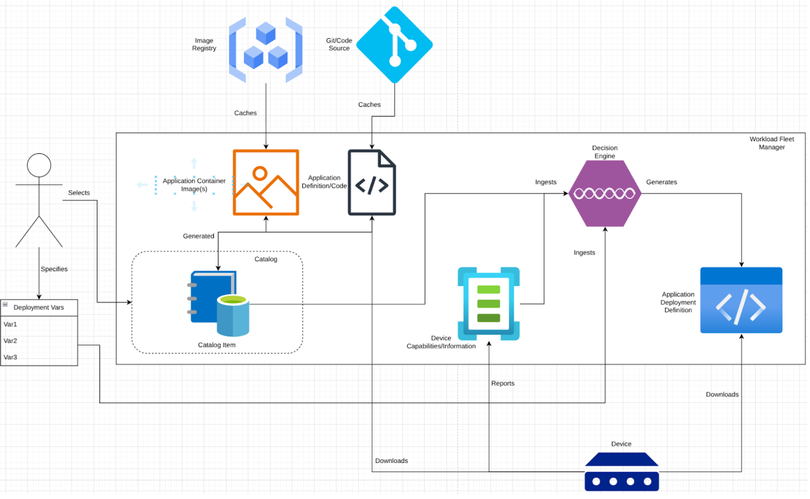

# Specification Update Proposal

## Owner

| Name | Email | Organization |
| --- | --- | --- |
| Josh Swanson | jswanson@redhat.com | Red Hat |
| Tim Mirth | tmirth@redhat.com | Red Hat |
| Luca Ferrari | ferrari@redhat.com | Red Hat |

## Summary

This SUP adds functionality to the workload fleet manager, allowing it to cache or proxy resources needed for application deployment.

This functionality allows for communication between an agent and the workload fleet manager to be more tightly controlled, and allows for a more secure operating environment for the devices, as their communication requirements and patterns are more predictable and controllable.

The intention of this SUP is not to enforce caching or proxying specifically - that can be up the vendor’s implementation - however: the desired behavior of “devices on agents get all they need to deploy applications from their workload fleet manager” is instead the focus.

## Reason for proposal

This SUP addresses functionality and behavior in-scope for Margo, specifically: the behaviors of managers and agents. Specifically, it adds a requirement for workload fleet managers, and adjusts the behavior of agents towards the workload fleet manager vs. direct connection to external locations.

## Requirements alignment acknowledgement

This SUP addresses functionality and behavior in-scope for Margo, specifically: the behaviors of managers and agents, thus, is aligned to Margo's overall scope and vision.

## Technical proposal

Note: Diagram for reference only, not 100% representative of Margo today.

This diagram shows the intention behind this SUP: the workload fleet manager handles either caching or proxying of the required content to deploy an application, allowing the device and agent to have a single communication point, which is controlled by the end user, be the only required communication point for the devices in protected networks/environments.

This offloads the responsibility for communication with external endpoints to the workload fleet manager, along with the handling of credentials - such as user/pass, tokens, etc.

This streamlines the communication required by devices to deploy an application, allowing for tighter control of the allowed flows for devices in regulated and controlled environments, while maintaining full functionality required for workload deployment.

A vendor may choose to have the workload fleet manager simply proxy the requests for resources from the devices, or may have the manager cache the content local to itself, helping to mitigate bandwidth issues when the devices and/or workload fleet manager are deployed to locations with limited connectivity.

This added requirement for workload fleet managers would broaden the applicability to more end users, and help them address challenges and requirements created by operational rules and regulations.

## Alternatives considered (optional)

This pattern of caching content for use by internal resources is used by many organizations who operate in disconnected or limited connectivity situations.

As an example, image registries such as Quay and Harbor offer mirroring functionality, as well as self-hosted options for customers. These allow for operation of devices and workload deployments even when the devices cannot directly reach external endpoints.

## Rejection reason

> If a SUP is rejected, indicate the reason why it was rejected.
> 
> Complete if SUP is rejected at Phase 2: Proposal Creation or Phase 4: Final Decision 
