# Specification Update Proposal

## Owner

Armand Craig
Nilanjan Samajder

## Summary

This SUP is focused on finalizing the technical details pertaining to our previously approved REST API, for usage between the Device and the Workload Fleet Manager. 
    - see the following [Link](https://github.com/margo/specification/issues/21) for a history on when the REST API was approved for the following functionalities
        - Onboarding of the API Interface 
        - Providing WFM with Device Capabilities information
        - Providing WFM with workload deployment status updates

Technical Details the SUP aims to finalize in the specification:

- Secure certificates utilized / format
- API Authentication Mechanism
- API Security / Encryption strategy
- How unique identifiers are produced and who is responsible for providing them/maintaining them. 
- Required Ports to enable the edge to cloud communication
- TLS Protocol version
- API definition / documentation strategy

What this SUP does not cover:
- How the API is onboarded in an automated fashion
- How the desired state is retrieved via the edge device
- Multi-vendor trusted CA strategy for Margo

## Reason for proposal

The main reason for this proposal is to complete and gain community consensus on the technical details pertaining to the decided API mechanism for Devices to communicate with the WFM. 

## Requirements alignment acknowledgement

This SUP is aligned with the following Technical Feature. 
- https://github.com/margo/specification/issues/101

## Technical proposal

> The SUP's technical details. There must be enough technical details that someone can take the information in this section and implement it on their own.

### General REST API information 
- This proposal recommends a server-side TLS-enabled REST API operating over HTTP1.1.
    - The motivation to utilize HTTP1.1 is to ensure maximum support for existing infrastructure within our install base. 
    - Server-side tls is utilized instead of mTLS due to possible issues with TLS terminating HTTPS load-balancer or a HTTPS proxy doing lawful inspection. See the API Security / Encryption section for more details.
- This REST API should utilize a known root CA the client can download, which enables the TLS handshake and other onboarding credentials to be details out in a separate SUP.  
### Secure certificates utilized / format
- This proposal recommends the usage of x.509 certificates to represent both parties within the REST API construction.
    - These certificates are utilized to prove each participants identity, establish secure TLS session, and securely transport information in secure envelopes. 
### API Authentication Mechanism
- Initial Trust via TLS
    - The device establishes a secure HTTPS connection using server-side TLS.
    - It validates the server’s identity using the public root CA certificate.
> Note: Further onboarding details will be provided in a separate SUP submission.
### API Security / Integrity strategy
- To ensure completeness in the description, I have copied over a section from the specification shown below
    - Due to the limitations of utilizing mTLS with common OT infrastructure components, such as TLS terminating HTTPS load-balancer or a HTTPS proxy doing lawful inspection, Margo has adopted a certificate-based payload signing approach to protect payloads from being tampered with. By utilizing the certificates to create payload envelopes (HTTP Request body), the device's management client can ensure secure transport between the device's management client and the Workload Fleet Management's web service.
    - For API security, Server side TLS 1.2 (minimum) is used, where the keys are obtained from the Server's X.509 Certificate as defined in standard HTTP over TLS
    - For API integrity, the device's management client is issued a client specific X.509 certificate.
    - The issuer of the server certificate is trusted under the assumption that the root CA download to the  Workload Fleet Management server occurs as a precondition to onboarding the devices 
    - Similarly the issuer of the client certificate is  trusted under the assumption that root CA download to the device's management client occurs over a "protected" connection as part of the yet to be defined device onboarding procedure  
    - Once the edge device has a message prepared for the Workload Fleet Management's web service, it completes the following to establish the integrity of the message.
        - The device's management client calculates a digest (one way hash with SHA256) and signature of the payload (message Request/Response body)
        - The device's management client creates a payload envelope as the HTTP Request comprising of :
            - the actual payload 
            - SHA256 hash of the payload
        - The devices's management client inserts the following in the HTTP1.1 Header X-Body-Signature field :
            - The base64 encoded signature of the SHA256 has of the payload, signed with the private-key of the Client X.509 certificate
    - On receiving the message from the Device Client, The Workload Fleet Management's web service does the following :
        - It identifies the client certificate from the Client-ID in the API Request URL 
        - The Workload Fleet Management's web service reads the SHA256 hash in the HTTP Request body and then uses the public key of the Client's X.509 certificate to decode the signature in the HTTP1.1 Header's X-Body-Signature field.
        - If the SHA256 hash in the HTTP Request body and the decoded signature in the HTTP Header's X-Body-Signature field match, then the payload is then processed by the Workload Fleet Management's web service.
        - I the two do not match, the Workload Fleet MAnager will repond with HTTP Error 401 as given below, and discontinue the session
          HTTP/1.1 401 Unauthorized
            Content-Type: application/json
            {
              "error": "Invalid signature",
              "message": "The X-Body-Signature header does not match the content of the request body."
            }

### Unique Identifiers
>Note: this section is still being formulated.
- This proposal recommends the WFM create a client id to uniquely identify each client within the architecture. 
    - This client ID MUST be in the format of UUIDv4

### Management Interface Ports
Required Ports to enable the edge to cloud communication
    - The goal of this API is to minimize the ports required for a customer to enable cloud to edge communication. 
        - This Rest API must ONLY utilize port 443 for it's traffic. 

### API definition / documentation strategy
- Initially this SUP proposes the usage of Open API REST definitions. 
### Working Prototype
WIP for certain portions of this SUP regarding the prototype. Additionally, I have attached a WIP Open API specification within the SUP folder.

### Mermaid diagram detailing the interaction patterns

```mermaid
sequenceDiagram
    autonumber
    participant Client
    participant Server

    Note over Client,Server: 🔐 Initial Trust Establishment

    Client->>Server: GET /onboarding/certificate
    Server-->>Client: certificate (base64-encoded Root CA)

    Note over Client,Server: 🔒 TLS Handshake
    Client->>Server: TLS ClientHello (TLS versions, cipher suites, random)
    Server-->>Client: TLS ServerHello (chosen version, cipher, random)
    Server-->>Client: X.509 certificate chain
    Client->>Server: Client public X.509 certificate

    Note over Server: Server verifies client cert and assigns UUID

    Client->>Server: POST /onboarding with public_certificate
    Server-->>Client: client_id, client_secret, endpoints list

    Note over Client,Server: 🔑 Token Exchange

    Client->>Server: POST /token (form-urlencoded: client_id, client_secret)
    Server-->>Client: access_token (JWT), token_type: Bearer, expires_in: 3600

    Note over Client,Server: 📡 Secure API Usage

    Client->>Server: POST /client/{clientId}/capabilities
    Server-->>Client: 201 Created

    Client->>Server: POST /client/{clientId}/deployment/{deploymentId}/status
    Server-->>Client: 201 Created
```

## Alternatives considered (optional)

> List any alternative solutions considered while working on the SUP and the reason for not choosing them. If the SUP owner knows that there is a risk of a competing SUP, this section can be used to make their case ahead of any potential votes on why their solution is better.
> 
> Complete as part of Phase 3: SUP Technical Development

## Rejection reason

> If a SUP is rejected, indicate the reason why it was rejected.
> 
> Complete if SUP is rejected at Phase 2: Proposal Creation or Phase 4: Final Decision 
