# Specification Update Proposal

## Owner

Armand Craig
Nilanjan Samajder

## Summary

This SUP is focused on finalizing the technical details pertaining to our previously approved REST API, for usage between the Device and the Workload Fleet Manager. 

- See the following [Link](https://github.com/margo/specification/issues/21) for a history on when the REST API was approved for the following functions:
    - Onboarding of the API Interface 
    - Providing WFM with Device Capabilities information
    - Providing WFM with workload deployment status updates

> Note: This SUP does not cover how the device receives and utilizes credentials to access application deployment components. i.e. Helm charts / OCI artifacts / Compose packages. 

Technical Details the SUP aims to finalize in the specification:

- Secure certificates utilized / format
- API Authentication Mechanism
- API Security / Encryption strategy
- How unique identifiers are produced and who is responsible for providing them/maintaining them. 
- Required Ports to enable the edge to cloud communication
- TLS Protocol version
- API definition / documentation strategy

What this SUP does not cover:
- How the API is onboarded in an automated fashion
- How the desired state is retrieved via the edge device
- Multi-vendor trusted CA strategy for Margo

## Reason for proposal

The main reason for this proposal is to complete and gain community consensus on the technical details pertaining to the decided API mechanism for Devices to communicate with the WFM. 

## Requirements alignment acknowledgement

This SUP is aligned with the following Technical Feature. 
- https://github.com/margo/specification/issues/101


## Technical proposal

### General REST API information 
- This proposal recommends a server-side TLS-enabled REST API operating over HTTP1.1.
    - The motivation to utilize HTTP1.1 is to ensure maximum support for existing infrastructure within our install base. 
    - Server-side tls is utilized instead of mTLS due to possible issues with TLS terminating HTTPS load-balancer or a HTTPS proxy doing lawful inspection. See the API Security / Encryption section for more details.
- This REST API should utilize a known root CA the client can download, which enables the TLS handshake and other onboarding credentials to be details out in a separate SUP.  
### Secure certificates utilized / format
- This proposal recommends the usage of x.509 certificates to represent both parties within the REST API construction.
    - These certificates are utilized to prove each participants identity, establish secure TLS session, and securely transport information in secure envelopes. 
### API Authentication Mechanism
- Initial Trust via TLS (version 1.3 or greater)
    - The device establishes a secure HTTPS connection using server-side TLS.
    - It validates the server’s identity using the public root CA certificate.
> Note: Further onboarding details will be provided in a separate SUP submission.
### API Security / Integrity strategy
- To ensure completeness in the description, I have copied over a section from the specification shown below
    - Due to the limitations of utilizing mTLS with common OT infrastructure components, such as TLS terminating HTTPS load-balancer or a HTTPS proxy doing lawful inspection, Margo has adopted a certificate-based payload signing approach to protect payloads from being tampered with. By utilizing the certificates to create payload envelopes (HTTP Request body), the device's management client can ensure secure transport between the device's management client and the Workload Fleet Management's web service.
    - For API security, Server side TLS 1.3 (minimum) is used, where the keys are obtained from the Server's X.509 Certificate as defined in standard HTTP over TLS
    - For API integrity, the device's management client is issued a client specific X.509 certificate.
    - The issuer of the client X.509 certificate is trusted under the assumption that the root CA download to the  Workload Fleet Management server occurs as a precondition to onboarding the devices 
    - Similarly the issuer of the server X.509 certificate is  trusted under the assumption that the root CA download to the device's management client occurs over a "protected" connection as part of the yet to be defined device onboarding procedure
#### Device Management Client
- Once the device management client has a message prepared for the Workload Fleet Management's web service, it MUST complete the following to establish the integrity of the message as defined in RFC 9421 :
    - The device's management client MUST create SHA256 hash Message-Digest of the base64 encoded payload (HTTP Request Body). This forms the 'Content-Digest' parameter in the HTTP Header.
    ```
        Content-Digest: sha-256=:<base64(SHA256(body))>:
    ```
    - The device management client MUST create a Signature Base String embedding the content-digest. An example is given below.
    ```
        @method: POST
        @target-uri: https://api.example.com/resource
        content-digest: sha-256=:<digest>:
        @signature-params: ("@method" "@target-uri" "content-digest");created=1680575171;keyid="my-rsa-key"
    ```
    - The device management client MUST create the Signature field by signing the SHA256 hash of the Base64 encoded Signature Base String, using the client X.509 RSA Private Key 
    - The devices's management client MUST insert the following in the HTTP1.1 Header :
        - Content-Digest as formed above
        - Signature-Input as given below, replacing the created and keyid parts appropriately :
        ```
            sig1=("@method" "@target-uri" "content-digest");created=<Put created timestamp here>;keyid="<put the Key-Name here>"
        ```
        - Signature as explained above
        - The base64 encoded signature of the SHA256 has of the payload, signed with the private-key of the Client X.509 certificate
        Note: The private-key is not stored in the X.509 certificate, it may be stored in a .pem file and this information is used while generating the X.509 certificate for the client
#### Workload Fleet Manager Web-Service           
- On receiving the message from the Device Client, The Workload Fleet Management's web service MUST do the following :
    - It identifies the client certificate from the Client-ID in the API Request URL 
    - The Workload Fleet Management's web service reads the following from the HTTP Request Header :
        - Signature-Input
        - Signature
        - Content-Digest (if body is present)
    - Use the Signature-Input in the header to determine which components were signed. Reconstruct the Signature Base canonical string using the actual values from the request including the SHA256 encoded content-digest from the received request body 
    - Then extract the base64-encoded message signature from the Signature header, and also compute the message signature string using the X.509 public-key and the Signature Base string.
    - If the message signature in the HTTP Header and the computed message signature match, then the payload is then processed by the Workload Fleet Management's web service.
    - I the two do not match, the Workload Fleet Manager will repond with HTTP Error 401 as given below, and discontinue the session
      ```
      HTTP/1.1 401 Unauthorized
        Content-Type: application/json
        {
          "error": "Invalid signature",
          "message": "The X-Body-Signature header does not match the content of the request body."
        }
      ```
### Unique Identifiers
- This proposal recommends the WFM create a client id to uniquely identify each client within the architecture. 
    - This client ID MUST be in the format of UUIDv4

> Note: This SUP does introduce a change in philosophy regarding the unique identifier, changing towards a more flexible client id that is separate from device id.  

### Management Interface Ports
Required Ports to enable the edge to cloud communication
    - The goal of this API is to minimize the ports required for a customer to enable cloud to edge communication. 
        - This Rest API must ONLY utilize port 443 for it's traffic. 

### API definition / documentation strategy
- Initially this SUP proposes the usage of Open API REST definitions. 
### Working Prototype
WIP for certain portions of this SUP regarding the prototype. Additionally, I have attached a WIP Open API specification within the SUP folder.

### Mermaid diagram detailing the interaction patterns

```mermaid
sequenceDiagram
    autonumber
    participant Client
    participant Server

    Note over Client,Server: 🔐 Initial Trust Establishment

    Client->>Server: GET /onboarding/certificate
    Server-->>Client: base64-encoded Root CA certificate
    Client-->>Client: injecting Root CA into trusted store
# Root CA is now trusted in the TLS handshake

    Note over Client,Server: 🔒 Standard TLS Handshake Start
    Client->>Server: TLS ClientHello (TLS versions, cipher suites, random)
    Server-->>Client: TLS ServerHello (chosen version, cipher, random)
    Server-->>Client: X.509 certificate chain(server + intermediate(if applicable))
    Client-->>Client: Verifies server cert chain based on RootCA
    Note over Client,Server: 🔒 Standard TLS Handshake completed
# standard TLS / but other flows can occur
    Client->>Server: POST /onboarding with public_certificate (could exchange additional info)
    
    # Verification of client cert out of scope of this. Pre specify 
    # approving this client can join the server. other things could be tied to the certificate. i.e. Cert supplied via Dell / serial number of device /
    # FDO bootstrapping off of ownership vouchers could be integrated here as well. 

    Note over Server: Server verifies client cert and assigns UUID
    Server-->>Client: 201 Created (client_id and endpoint list)
    Note over Client,Server: 📡 Secure API Usage with Signed Payloads

    Client->>Server: POST /client/{clientId}/capabilities
    Server-->>Client: 201 Created
    Note over Client,Server: Enrollment is complete

    Note over Client,Server: Assumed Desired state has been transmitted via WFM(out of scope for this SUP)
    Note over Client,Server: 📡 Secure API Usage with Signed Payloads
    Client->>Server: POST /client/{clientId}/deployment/{deploymentId}/status
    Server-->>Client: 201 Created
```


## Alternatives considered (optional)

> List any alternative solutions considered while working on the SUP and the reason for not choosing them. If the SUP owner knows that there is a risk of a competing SUP, this section can be used to make their case ahead of any potential votes on why their solution is better.
> 
> Complete as part of Phase 3: SUP Technical Development

## Rejection reason

> If a SUP is rejected, indicate the reason why it was rejected.
> 
> Complete if SUP is rejected at Phase 2: Proposal Creation or Phase 4: Final Decision 
