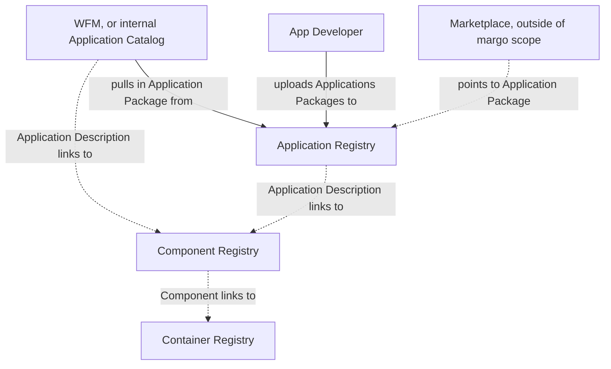
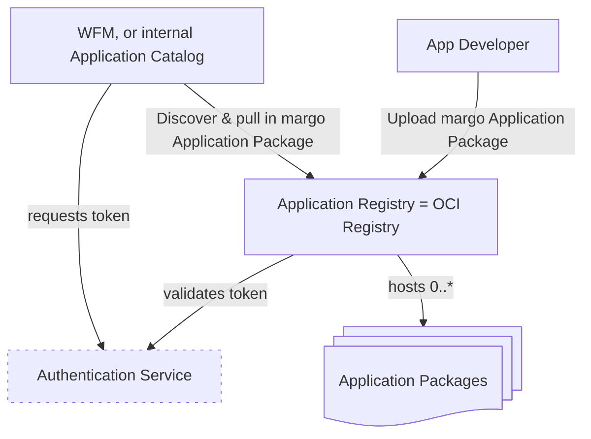
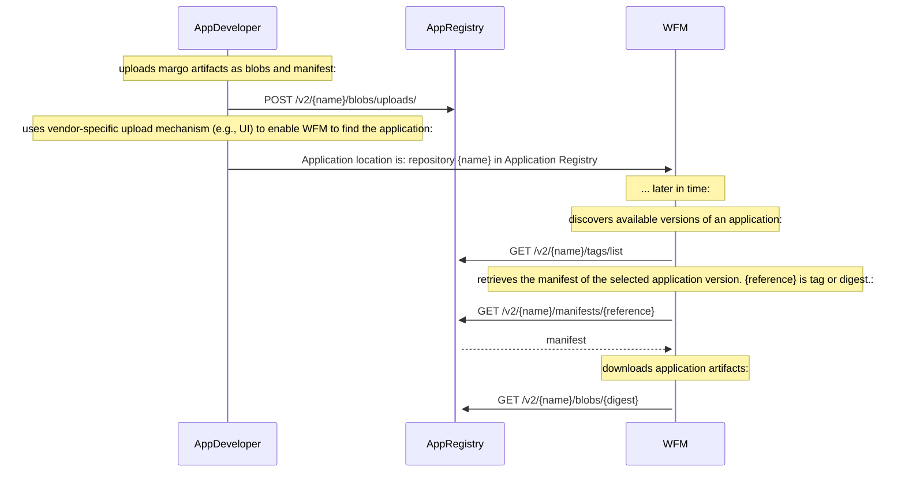

# Specification Update Proposal

## Owner

[@arne-broering](https://github.com/arne-broering)

## Summary

Instead of using Git to provide an application to WFM, a REST API is used - the well-established [OCI Registry API (v1.1.0)](https://github.com/opencontainers/distribution-spec/blob/v1.1.0/spec.md) for digital artifact distribution is used. Re-utilizing OCI Registries offers the benefit of leveraging available libraries and tools for registries and clients (e.g., [oras](https://oras.land/) (OCI Registry as Storage) as a client, and [Docker Registry](https://github.com/distribution/distribution), [Nexus](https://www.sonatype.com/products/nexus-repository) or [Harbor](https://github.com/goharbor/harbor) as registries).

Please find [here](https://github.com/margo/app-package-definition-wg/blob/main/application-registry-example/app_registry_as_oci_registry.md) a reference implementation that demonstrates how to use an OCI Registry as a margo Application Registry.

## Reason for proposal

This SUP relates to  [feature 89](https://github.com/margo/specification/issues/89), which addresses the need for Margo to prescribe a way for App developers to host and securely provide access to application packages and application description files.

The margo [specification currently recommends Git](https://specification.margo.org/app-interoperability/workload-orch-to-app-reg-interaction/) for application distribution, but there are several reasons against this:

1. Git is an industry standard but not a specification so there is no way to implement compliance testing based on Git. It also means the Git implementation could change at any point. This proposal addresses this concern by using a well-defined specification with clear compliance requirements.
1. Since Git is not based on a specification this proposal references an established specification. Vendors have the freedom to choose whichever implementation approach they wish to comply with the Margo specification.
1. Alignment with the currently ongoing definition of a REST API for the desired state using the same technology as proposed here.

## Requirements alignment acknowledgement

This proposal addresses [feature 89](https://github.com/margo/specification/issues/89):

1. Define standard interface
1. Define security aspects of interface and responsibility
1. Define how the WFM "onboards" to the description storage location
1. Reference implementation utilizing open-source components and example security components.

## Technical proposal

This proposal recommends the [OCI Registry API specification version 1.1.0](https://github.com/opencontainers/distribution-spec/blob/v1.1.0/spec.md) (henceforth abbreviated as "OCI-spec") to standardize how margo applications are provided to the Workload Flow Manager (WFM). 

### Re-cap

(as already defined in the [margo specification](https://specification.margo.org/margo-overview/software-composition))

An `Application Package` is a *folder* with a Margo-defined structure that contains:
* `Application Description`: YAML file following the [margo-specific](https://specification.margo.org/app-interoperability/application-package-definition/) structure and format, defining the composition of one or more `Components` that form the application.
* Application `resources`: files of icons, license(s), or release notes that provide further information about the application.

The Application Package is hosted by an Application Registry.

`Components`, linked in the Application Description document, are deployable as `workloads`, and are provided in a Margo-supported way, e.g. as `Helm Charts` or `Compose Archives`. 

`Components` are stored in `Component Registries`, which are out of scope of this SUP. However, a `Component Registry` may also (typically) by an OCI registry.




### Proposed Architecture

The proposed architecture consists of:

* `Application Registry` - Implemented as an `OCI Registry`, it serves [Application Packages](https://specification.margo.org/app-interoperability/application-package-definition/) defined through `Application Description` files.
* `Workload Fleet Manager`, or internal `Application Catalog`, acting as client to pull applications from the registry.
* `Authentication Service` - Manages access control for the registry.
* `App Developer` - The actor who uploads the application to the Application Registry.



#### API Endpoints
The Application Catalog / WFM will interact with the Application Registry using standard OCI Registry API endpoints:

* Tags: `/v2/{name}/tags/list` for listing available versions of the Application Package
* Manifest: `/v2/{name}/manifests/{reference}` for retrieving manifests pointing to the parts of the Application Package
* Blob: `/v2/{name}/blobs/{digest}` for downloading parts of the Application Package

`{name}` is the namespace of the repository, which needs to be directly communicted by the App Developer to the WFM vendor. It could be for example a combination of the organization's and application's name.

#### Authentication & Authorization & Security
This proposal recommends that margo centrally defines authentication & authorization (& ssecurity) mechanism, e.g., recommending the use of OAuth 2.0 with the following workflow:

* WFM obtains credentials during onboarding
* WFM requests a token from an Authentication Service
* WFM uses the token for subsequent API calls to the Application Registry
* Application Registry validates the token and enforces access control

All communications should use TLS 1.3+ to ensure transport security.

> However, Authentication & Authorization & Security mechanisms should be defined centrally and homogeneously across margo. Hence, it is out of scope of this proposal.

Further, tools such as [cosign](https://github.com/sigstore/cosign) can be employed for signing artifacts uploaded to the Application Registry and storing the signatures alongside the artifacts they verify.

#### Reference Implementation
A reference implementation can be found [here](https://github.com/margo/app-package-definition-wg/blob/main/application-registry-example/app_registry_as_oci_registry.md). It utilizes:

* Application Registry: Docker Registry (open source OCI Registry)
* Client Library: ORAS (OCI Registry as Storage) tool
* Examples: Sample applications and configuration for demonstration

#### Overview of Interactions




### margo 'Application Registry' API Endpoint Definitions towards App Developer (aligned with OCI_spec)

#### Upload a margo Application Package

The Application Developer uploads the margo-compliant `Application Package` to the Application Reistry. I.e., the parts of the Application Package are uploaded as blobs and a manifest is created via the [end-4a / end-4b](https://github.com/opencontainers/distribution-spec/blob/v1.1.0/spec.md#endpoints) endpoints.

Thereby, the Application Developer needs to make sure the manifest will be adhering to the margo-specific constraints detailed [here](#manifest-as-response-from-application-registry).
Other than these constraints on the manifest format, there are no further margo-specific constraints regarding the upload of the Application Package and the OCI_spec applies to this interface of the Application Registry. 

This process of uploading a margo Application Package is described in the [reference implementation](https://github.com/margo/app-package-definition-wg/blob/main/application-registry-example/app_registry_as_oci_registry.md).


### margo 'Application Registry' API Endpoint Definitions towards WFM (aligned with OCI_spec)

#### List margo Application Package Versions

This must be implemented according to OCI_spec endpoint [end-8a / end-8b](https://github.com/opencontainers/distribution-spec/blob/v1.1.0/spec.md#endpoints).
Use `tags` to discover available versions of a Margo application.
`{name}` is the namespace of the repository, which needs to be directly communicted by the App Developer to the WFM vendor.

`GET /v2/{name}/tags/list`

##### Headers:

```Authorization: Bearer <token>```
> However, security mechanism needs to be margo-centrally defined.

##### Query Parameters:

* n=<integer> (optional, limits results)
* last=<string> (optional, pagination cursor)

#####  Success Response:

200 OK with list of tags

##### Example Response:

```json
{
  "name": "organization/app1",
  "tags": [
    "v1.0.0",
    "v1.1.0",
    "latest"
  ]
}
```

#### Pull margo Application Manifest
This must be implemented according to OCI_spec endpoint [end-3](https://github.com/opencontainers/distribution-spec/blob/v1.1.0/spec.md#endpoints).
Pulls a manifest of a specified version of a margo Application Package.
The `{reference}` is the `tag` of a margo application manifest. The `tag` has been discovered via the [listing of app versions](#list-margo-application-versions).
`{name}` is the namespace of the repository.

``` GET /v2/{name}/manifests/{reference} ```

##### Headers:

`Authorization: Bearer <token>`
> However, security mechanism needs to be margo-centrally defined.

`Accept: application/vnd.oci.image.manifest.v1+json`

##### Success Response:

200 OK with manifest content

##### Fail Response:

404 Not Found if manifest doesn't exist

##### Manifest as Response from Application Registry:

In the margo context, manifests contain pointers to all parts of an Application Package within an Application Registry. 

Each ``version`` of an Application Pacakage has its own manifest.

The ``schemaVersion`` of the manifest needs to be ``2``.

The ``artifactType`` of the manifest must be ``application/vnd.org.margo.app.v1+json``.

The ``config`` object must be declared as empty by defining its ``mediaType`` as ``application/vnd.oci.empty.v1+json``. 

Each element of the ``layers`` array contains a reference (so called `digests`) to an artifact (so called `blobs`) that is part of the Application Package.
Each artifact of an Application Package must be listed as an element of the ``layers`` array.

The [Application Description](https://specification.margo.org/margo-api-reference/workload-api/application-package-api/application-description/) of the Application Package must be referred to in one element of the ``layers`` array. The ``mediaType`` of this layer/blob must be ``application/vnd.margo.app.description.v1+yaml``.

Each [application resource](https://specification.margo.org/app-interoperability/application-package-definition/), which are additional files associated with the application (e.g., manual, icon, release notes, license file, etc.), must be referred to in an element of the ``layers`` array and an ``annotation`` must be added to this element, which has the annotation key ``org.margo.app.resource``, and the annotation value must reflect the dotted path to the this resource in the Application Description. E.g., an application icon stored as the file ``resources/margo.jpg`` will be referenced in the Application Description   under ``metadata.catalog.application.icon: resources/margo.jpg`` and in the OCI manifest, the respective layer of the icon resource has the annotation ``org.margo.app.resource`` with the value ``metadata.catalog.application.icon``.


The following response example is a margo-specific manifest following the [OCI Image Manifest Specification](https://github.com/opencontainers/image-spec/blob/v1.0.1/manifest.md) and the above defined specifics:

```json
{
  "schemaVersion": 2,
  "mediaType": "application/vnd.oci.image.manifest.v1+json",
  "artifactType": "application/vnd.org.margo.app.v1+json" # this MUST be the artifactType of a margo application,
  "config": {
    "mediaType": "application/vnd.oci.empty.v1+json", # the 'config' object MUST be empty
    "digest": "sha256:44136fa355b3678a1146ad16f7e8649e94fb4fc21fe77e8310c060f61caaff8a",
    "size": 2,
    "data": "e30="
  },
  "layers": [
    {
      "mediaType": "application/vnd.margo.app.description.v1+yaml", # this MUST be the artifactType of a margo Application Package
      "digest": "sha256:f6b79149e6650b0064c146df7c045d157f3656b5ad1279b5ce9f4446b510bacf",
      "size": 999,
      "annotations": {
        "org.opencontainers.image.title": "margo.yaml"
      }
    },
    {
      "mediaType": "text/markdown",
      "digest": "sha256:e373b123782a2b52483a9124cc9c578e0ed0300cb4131b73b0c79612122b8361",
      "size": 1596,
      "annotations": {
        "org.margo.app.resource": "metadata.catalog.application.descriptionFile", # each margo application resource MUST be annotated like this
        "org.opencontainers.image.title": "resources/description.md"
      }
    },
    {
      "mediaType": "text/markdown",
      "digest": "sha256:af7db4ab9030533b6cda2325247920c3659bc67a7d49f3d5098ae54a64633ec7",
      "size": 25,
      "annotations": {
        "org.margo.app.resource": "metadata.catalog.application.licenseFile", # each margo application resource MUST be annotated like this
        "org.opencontainers.image.title": "resources/license.md"
      }
    },
    {
      "mediaType": "image/jpeg",
      "digest": "sha256:451410b6adfdce1c974da2275290d9e207911a4023fafea0e283fad0502e5e56",
      "size": 5065,
      "annotations": {
        "org.margo.app.resource": "metadata.catalog.application.icon", # each margo application resource MUST be annotated like this
        "org.opencontainers.image.title": "resources/margo.jpg"
      }
    },
    {
      "mediaType": "text/markdown",
      "digest": "sha256:c412d143084c3b051d7ea4b166a7bfffb4550f401d89cae8898991c65e90f736",
      "size": 42,
      "annotations": {
        "org.margo.app.resource": "metadata.catalog.application.releaseNotes", # each margo application resource MUST be annotated like this
        "org.opencontainers.image.title": "resources/release-notes.md"
      }
    }
  ],
}
```

##### Margo-Specific Media Types

|Media Type|Description|
|----------|----------|
|``application/vnd.margo.app.description.v1+yaml``	|Margo application description file|

##### Margo-Specific Annotation Keys

|Annotation Key | Description|
|----------|----------|
|``org.margo.app.resource``	| This MUST be used to annotate a layer/blob that references a margo application resource |


#### Get margo Application Artifact
This must be implemented according to OCI_spec endpoint [end-2](https://github.com/opencontainers/distribution-spec/blob/v1.1.0/spec.md#endpoints).
Retrieves a margo application artifact by pulling a blob. 
`{digest}` is the blobs digest as listed in the application's manifest that has been [retrieved earlier](#pull-margo-application-manifest).
`{name}` is the namespace of the repository.


`GET /v2/{name}/blobs/{digest}`

##### Headers:

`Authorization: Bearer <token>`
> However, security mechanism needs to be margo-centrally defined.

##### Success Response:

`200 OK with blob content`

##### Fail Response:

`404 Not Found if blob doesn't exist`


## Alternatives considered (optional)

> List any alternative solutions considered while working on the SUP and the reason for not choosing them. If the SUP owner knows that there is a risk of a competing SUP, this section can be used to make their case ahead of any potential votes on why their solution is better.
> 
> Complete as part of Phase 3: SUP Technical Development

## Rejection reason

> If a SUP is rejected, indicate the reason why it was rejected.
> 
> Complete if SUP is rejected at Phase 2: Proposal Creation or Phase 4: Final Decision 
