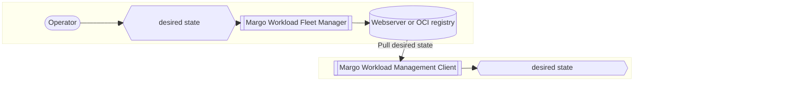
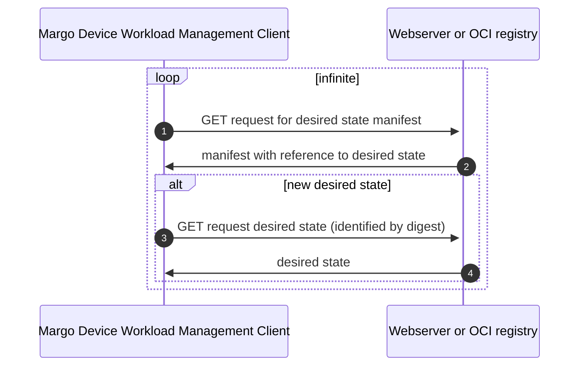

# Specification Update Proposal

## Owner

[@silvanoc](https://github.com/silvanoc)

## Summary

Instead of using Git to transport the desired state to the device, a REST API is used - namely, a well-established, well-defined, and widely-used API for digital artifact distribution and management.
This API is particularly easy to implement thanks to its simplicity, making it accessible for devices with varying capabilities.

This approach offers the significant benefit of leveraging available registries and client libraries.
There are multiple open-source software implementations of both registries and client libraries that are battle-tested and widely used across the industry, eliminating the need to develop and maintain custom solutions.

## Reason for proposal

This SUP relates to parts of [feature 100](https://github.com/margo/specification/issues/100) and [feature 101](https://github.com/margo/specification/issues/101), which addresses the need to define the desired state artifact(s) that are produced via the WFM, and retrieved via the edge client, to enable state seeking management of workloads at the edge.

The [specification currently indicates Git](https://specification.margo.org/fleet-management/workload/workload-deployment/) is used for this process, but the Margo TWG members voted against using Git because of the following:

1. Git is an industry standard, but not a specification, so there is no way to implement compliance testing based on Git. It also means the Git implementation could change at any point. This proposal addresses this concern by using a well-defined specification with clear compliance requirements.
1. Since Git was not based on a specification, the members felt we were dictating an implementation. This proposal addresses this concern by referencing an established specification. Vendors have the freedom to choose whichever implementation approach they wish to comply with the Margo specification.
1. There were concerns over the amount of additional storage space a git repository requires on the device. While this can be alleviated with shallow checkouts, using an artifact-based approach for the desired state doesn't include the complete history like a Git repository does.
1. There were concerns over the overhead of requiring a git client on the device. With this proposal, requests are all HTTP(s) requests and can be made using standard HTTP(s) clients/libraries.
1. There were concerns over the chattiness between the Git client and the server. By controlling the contents of the blob, we have some control over how chatty the API calls will be. We will need to keep this in mind as we work on the technical details for this proposal.

Additionally, there are multiple different implementations of the proposed REST-API, some of them for free.
Therefore, the required infrastructure is frequently available and is being used for software distribution.

## Requirements alignment acknowledgement

This proposal addresses parts of [feature 100](https://github.com/margo/specification/issues/100) and [feature 101](https://github.com/margo/specification/issues/101).

The following is in scope for this proposal:

1. Packaging and distributing the desired state documents
1. Using the APIs defined in the [REST-API Specification](#rest-api-specification) section for pulling the desired state to the device

The following is not in scope for this proposal:

1. Defining how the device receives the location and authentication information for where the desired state documents are available
1. Defining how a device is notified when the desired state documents are updated beyond using the "latest" tag
1. Securing/signing the desired state documents

## Technical proposal

### REST-API Specification

The well-established REST API of the [OCI Distribution v1.1 specification](https://github.com/opencontainers/distribution-spec/blob/v1.1.0/spec.md) is the proposed REST API. This results in the benefit of allowing available OCI registries and client libraries to be used, as well as allowing Workload Fleet Manager suppliers to option to implement their backend solution without requiring the use of an OCI registry.

Additionally, [API-conformance tests](https://github.com/opencontainers/distribution-spec/tree/main/conformance) are available to validate any implementation.

### Protocol Support

The REST API implementation supports HTTP 1.1, ensuring compatibility with a wide range of client libraries and network infrastructures.
This support is particularly important as many target networks, especially in industrial and legacy environments, only support HTTP up to version 1.1.
By maintaining compatibility with HTTP 1.1, the solution ensures deployability across restricted network environments where newer HTTP protocol versions may not be available or allowed through firewalls and proxies.

### Architectural considerations

Getting an edge device to execute one or more workloads implies:

1. Obtaining the desired state, which describes the workload(s) that should be executed.
2. Getting any resources required by the workloads (e.g,. a container image).
3. Executing the workload.

This proposal only deals with the first step for obtaining the desired state.
Although an OCI registry can also be used to distribute resources required by the workloads, that part is out of the scope of this proposal.

Although it is possible to push the desired state to an edge device, this proposal relies on a pull approach.
Based on triggers (signal from the backend, schedule for polling,...), the edge device checks if a new desired state is available in the backend.

The following components and concepts are relevant to achieving the desired state of an edge device:

1. A signal for the edge device to check the availability of a new desired state.
2. Making the desired state available for the edge device to pull. According to current decisions, this MUST be a REST API.
3. The format of the payload provided by the aforementioned REST API to package the desired state.

#### Signal: Check Desired State

There are two possibilities:

1. Internal triggering: the edge device regularly checks the availability of a new desired state (AKA polling).
2. External triggering: the edge device gets notified somehow from the backend that a new desired state is available.

This proposal is not focused on any of them and assumes, for now, that a polling approach is used since this is what the specification currently indicates.

#### Fetch Desired State: REST API

This is the main scope of this proposal.

As mentioned above, the core of the proposal is a REST API compatible with the OCI distribution API, with the ultimate goal of enabling the use of available OCI registries and clients(e.g., ORAS, FluxCD, ArgoCD), if desired.

However, the option remains open for implementing a custom solution using a simple and well-defined API, so using an OCI registry is not mandatory.

The following aspects are to be considered when fetching the desired state concerning security:

#### Authentication and Authorization

Authentication and authorization are not in scope for this proposal.

The [Open Container Initiative Distribution Specification](https://github.com/opencontainers/distribution-spec/blob/main/spec.md) does not address authentication and authorization.

OCI registries implement the [Docker Registry v2 protocol](https://docker-docs.uclv.cu/registry/spec/api/), which uses [RFC 7235](https://www.rfc-editor.org/rfc/rfc7235) to define the WWW-Authenticate header to indicate which authentication schemes are supported. Most OCI registries support at a minimum [Basic](https://www.rfc-editor.org/rfc/rfc7617) and [Bearer Token](https://www.rfc-editor.org/rfc/rfc6750) schemes for authentication.

#### Tampering Attacks

Signing and security are outside the scope of this proposal. The expectation is that future proposals will address how these are handled to ensure the integrity and authenticity of the desired state artifacts.

#### Rollback Attacks

If whatever desired state being provided is considered valid, there is a chance for a rollback (AKA [Downgrade](https://en.wikipedia.org/wiki/Downgrade_attack)) attack in which an old desired state with vulnerabilities is "rolled back" (by a malicious attacker or mistakenly).

To avoid these kinds of attacks, the following aspects are to be considered:

- The reliability of the desired state freshness will depend on how trustworthy the desired state hosting can be considered. It is expected that the services hosting the desired state artifact follow best practices to ensure the security and integrity of the hosted artifacts. This is outside Margo's scope

> **MORE DISCUSSION NEEDED**: Need some more details here. I proposed adding an attribute to the manifest to indicate the minimum acceptable version of the desired state. This would allow the Device to reject any desired state blob with a version older than what is already applied on the device. This would require the Workload Fleet Manager and device to keep track of the version of the last created and applied desired state blob.

### Top-level view



### 2-step workflow



### Management client requests

It MUST be possible for the device to pull the manifest and blob using the behavior defined in the [Open Container Initiative Distribution Specification](https://github.com/opencontainers/distribution-spec/blob/main/spec.md) for the following endpoints.

|  |  |  |
|---|---|---|
| GET/HEAD | /v2/\<name\>/manifests/\<reference\>| Used to pull the manifest describing the device's desired state|
| GET/HEAD | /v2/\<name\>/blobs/\<digests\>| Used to pull the blob containing the device's desired state|

The routes provided to the device by the Workload Fleet Manager do not have to match the routes defined in the Open Container Initiative Distribution Specification (e.g., workload fleet manager is using an API-Gateway to expose the registry) but the behavior of the endpoint MUST match with regard to the request headers, parameters, and payload,d and response headers and payloads

> **MORE DISCUSSION NEEDED:** The original proposal had endpoints defined with the expectation that an API-Gateway would be used. I feel it's more flexible if we expect the WFM to provide the URLs they want, so they have the option of using API Gateway, pointing directly to an existing OCI registry, or pointing to their custom web service implementation.

How this information is provided is outside the scope of this proposal, but the expectation is that the Workload Fleet Manager provides it during onboarding.

#### Manifest request

The Workload Fleet Manager MUST provide the manifest URL that the device must call to obtain the manifest. The API is expected to behave as defined in the [Open Container Initiative Distribution Specification](https://github.com/opencontainers/distribution-spec/blob/main/spec.md) for the `GET /v2/\<name\>/manifests/\<reference\>` endpoint. When the Workload Fleet Manager provides the manifest URL, it also provides the `reference` (aka tag) to use for the request.

##### Response

> **MORE DISCUSSION NEEDED**: The original proposal suggested sending a single ApplicationDeployment.yaml in the desired state blob so each workload would have its own desired state manifest. This approach doesn't address the concerns around having a chatty API that were raised around using Git. Also, this makes it more difficult to get a picture of the whole desired state the device should have. As an alternative, we suggested following the declarative approach, and instead of sending a single ApplicationDeployment.yaml, it would instead send the entire desired state for all workloads in the blob so the device can ensure everything matches.

The response from the endpoint provides the desired state manifest JSON document defined by the [OCI Image Manifest Specification](https://github.com/opencontainers/image-spec/blob/v1.0.1/manifest.md) containing the information about the configuration, layers, and annotations for the desired state blob.

The manifest file MUST be created as defined by the OIC Image Manifest Specification with the following additional requirements:

- The Media Type for the manifest MUST be `application/vnd.oci.image.manifest.v1+json`
- The Artifact Type MUST be `application/vnd.org.margo.config.v1+json`
- The manifest MUST contain a single layer containing configuration for the desired state TAR GZIP file
- The Media Type for the desired state TAR GZIP file layer MUST be `application/vnd.org.margo.manifests.layer.v1+tar+gzip`

##### Response payload

> **DISCUSSION NEEDED**: This probably isn't the proper manifest, so we'll need to work through the details.

```JSON
{
    "schemaVersion": "2",
    "mediaType": "application/vnd.oci.image.manifest.v1+json",
    "artifactType": "application/vnd.margo.config.v1+json",
    "config": {
        "data": "<string>",
        "digest": "<string>",
        "mediaType": "applicationvnd.oci.empty.v1+json",
        "size": "<integer>",
    },
    "layers": [
        {
            "mediaType": "application/vnd.margo.manifests.layer.v1+tar+gzip",
            "digest": "<string>",
            "size": "<integer>
        }
    ]
}
```

| Property | Required | Data Type | Description |
| -------- | -------- | --------- | ----------- |
| schemaVersion | Y | string | MUST be `2` to comply with the [OCI Image v1.1 specification](https://github.com/opencontainers/image-spec/blob/v1.1.0/manifest.md#image-manifest-property-descriptions). |
| mediaType | Y | string | MUST be `application/vnd.oci.image.manifest.v1+json` for clients to be able to confirm the expected data type. |
| artifactType | Y | string | MUST be `application/vnd.org.margo.config.v1+json` for clients to be able to confirm the expected data type. |
| config.data | N | string | MUST be `e30=` which is the base64 encoded content representing an empty config file. |
| config.digest | Y | string | This is the hash representing the empty config file. The value MUST comply with the [OCI Image v1.1 digest specification](https://github.com/opencontainers/image-spec/blob/main/descriptor.md#digests) |
| config.mediaType | Y | string | MUST be `application/vnd.oci.empty.v1+json` for clients to be able to confirm the expected data format. |
| config.size | Y | integer | The size of the data before Base64 encoding. It can be used as a loose way to verify data integrity; the digest is a much better option for integrity verification. |
| layers | N | []map[string] | Single item array containing the information about the desired state TAR GZIP file layer. |
| layers[].mediaType | Y | string | MUST be `application/vnd.margo.manifests.layer.v1+tar+gzip` for clients to be able to confirm the expected data type. |
| layers[].digest | Y | string | This is the hash the WOS associates with the desired state TAR GZIP file at that point in time. The value MUST comply with the [OCI Image v1.1 digest specification](https://github.com/opencontainers/image-spec/blob/main/descriptor.md#digests). It is a hash of the bytes of the desired state TAR GZIP file, which can be used to verify the integrity of the data. |
| layers[].size | Y | integer | The size of the desired state TAR GZIP file. It can be used as a loose way to verify data integrity; the digest is a much better option for integrity verification. |

#### Blob request

The Workload Fleet Manager MUST provide the blob URL that the device MUST call to obtain the desired state blob. The API is expected to behave as defined in the [Open Container Initiative Distribution Specification](https://github.com/opencontainers/distribution-spec/blob/main/spec.md) for the `GET /v2/\<name\>/blobs/\<digests\>` endpoint. The digest to use for the call is retrieved from the manifest response payload.

##### Request payload

None

##### Response description

The response from the endpoint provides a TAR GZIP file containing the [Margo Desired State specification](https://specification.margo.org/margo-api-reference/workload-api/desired-state-api/desired-state/) YAML files for all workloads that should be deployed on the device.

The TAR file MUST only contain the individual desired state YAML files, in plain text, for each workload expected to be deployed on the device. There are no requirements for how the individual YAML files are organized within the TAR file.

The following rules MUST be followed by the device when applying the latest desired state:

- If the workload's desired state YAML file was not in the previous desired state blob, the device MUST attempt to install the new workload
- If the workload's desired state YAML file was in the previous desired state blob, but has changes, the device MUST attempt to update the existing workload
- If the workload's desired state YAML file was in the previous desired state blob, but has NOT changed, the device is not required to do anything for the existing workload
- If the workload's desired state YAML file was in the previous desired state blob, but not in the latest desired state blob, the device MUST attempt to remove the existing workload.

## Alternatives considered (optional)

> List any alternative solutions considered while working on the SUP and the reason for not choosing them. If the SUP owner knows that there is a risk of a competing SUP, this section can be used to make their case ahead of any potential votes on why their solution is better.

## Rejection reason

> If a SUP is rejected, indicate the reason why it was rejected.
