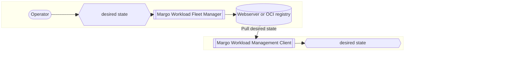
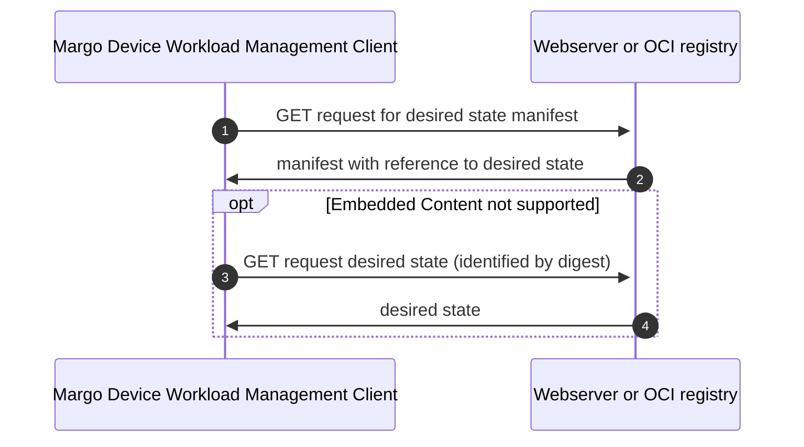

# Specification Update Proposal

## Owner

[@silvanoc](https://github.com/silvanoc)

## Summary

Instead of using Git to transport the **desired state** to the device, a **REST API** is used - namely, a well-established, well-defined, and widely-used API for digital artifact distribution and management.
This API is particularly easy to implement thanks to its simplicity, making it accessible for devices with varying capabilities.
The details on that API can be found in the section [Technical proposal](#technical-proposal).

This approach offers the significant benefit of leveraging available registries and client libraries.
There are multiple open-source software implementations of both registries and client libraries that are battle-tested and widely used across the industry, eliminating the need to develop and maintain custom solutions.

### Benefits of using OCI for desired state

* OCI blobs are being used increasingly for distributing content. It has been used for a long time for distributing container images and Helm charts, and is starting to be used more and more to distribute other types of content. Margo is already planning on using OCI blobs to distribute Helm charts and Docker images.
* There are many OCI compatible servers, clients, tools, and SDKs that can be used instead of needing to implement anything Margo specific.
* There are existing patterns for signing OCI blobs that can be applied
* We are enabling the use of existing standards and implementations instead of inventing something Margo-specific that would require a custom implementation.
* Placing desired state content in an OCI blob is more flexible/future-proof. If we have more that needs to be provided in the future than the desired state yaml files, the same approach will work without needing to change APIs.

## Reason for proposal

The [specification currently indicates Git](https://specification.margo.org/fleet-management/workload/workload-deployment/) is used for this process, but the **Margo TWG members voted against using Git** because of the following:

1. Git is an industry standard, but not a specification, so there is no way to implement compliance testing based on Git.
   It also means the Git implementation could change at any point.
   This proposal addresses this concern by using a well-defined specification with clear compliance requirements.
1. Since Git was not based on a specification, the members felt we were dictating an implementation.
   This proposal addresses this concern by referencing an established specification.
   Vendors have the freedom to choose whichever implementation approach they wish to comply with the Margo specification.
1. There were concerns over the amount of additional storage space a git repository requires on the device.
   While this can be alleviated with shallow checkouts, using an artifact-based approach for the desired state doesn't include the complete history like a Git repository does.
1. There were concerns over the overhead of requiring a git client on the device.
   With this proposal, requests are all HTTP(s) requests and can be made using standard HTTP(s) clients/libraries.
1. There were concerns over the chattiness between the Git client and the server.
   By controlling the contents of the blob, we have some control over how chatty the API calls will be.
   We will need to keep this in mind as we work on the technical details for this proposal.

It is therefore out of the scope of this proposal to argue why this proposal uses a REST API instead of Git.

This Specification Update Proposal (SUP) relates to parts of [feature 100](https://github.com/margo/specification/issues/100) and [feature 101](https://github.com/margo/specification/issues/101), which address the need to define the desired state artifact(s) that are produced via the WFM and retrieved via the edge client, to enable state seeking management of workloads at the edge.

The REST API being proposed (detailed in the section [Technical proposal](#technical-proposal)) has multiple different implementations, many of them open source software (OSS).
Additionally, the required infrastructure is frequently available and is being used for software distribution (e.g., for container images).

## Requirements alignment acknowledgement

This proposal addresses parts of [feature 100](https://github.com/margo/specification/issues/100) and [feature 101](https://github.com/margo/specification/issues/101).

The following is in scope for this proposal:

1. Packaging and distributing the desired state documents
1. Using the APIs defined in the [REST-API Specification](#rest-api-specification) section for pulling the desired state to the device
1. Provide as much security as possible with the current scope and provide extension points for advanced security.

The following is not in scope for this proposal:

1. Defining mechanisms for edge device authentication and authorization to fetch the desired state documents.
1. Ensuring that only specific versions of valid (authenticity and integrity) desired state documents can be installed to avoid installation of vulnerable versions
1. Securing the authenticity and integrity of the individual desired state documents (via signatures)

## Technical proposal

Getting an edge device to execute one or more workloads implies:

1. Obtaining the desired state, which describes the workload(s) that should be executed.
1. Getting any resources required by the workloads (e.g, a container image).
1. Executing the workload.

This proposal only deals with the first step for obtaining the desired state.
It is important to notice, though, that hereby proposed REST API can also be used to distribute resources required by the workloads, which is one of the motivations for this proposal.

It is important to remember that the decision to use a REST API instead of Git (which the specification currently describes) to distribute the desired state was **voted on by the Margo TWG members**.
It is therefore considered out of discussion in this proposal.

The following two approaches can be used to achieve the desired state of one or more applications on an edge device:

1. The edge device fetches (pulls) the new desired state documents.
   This requires a specification of the format and protocol to distribute those documents, which includes the REST API and the "packaging".
   Check the section [Fetch desired state: REST API](#fetch-desired-state-rest-api) for more details on this.
1. The edge device is signaled (notification from the backend, internal schedule for polling,...) to check the availability of new desired state document(s).
   Check the section [Signal: Update desired state](#signal-update-desired-state) for more details on this.

This specification only proposes implementing the pull approach, but does not prevent a notification approach from being proposed in the future as an enhancement.

This proposal is very similar to the previous Git approach and represents almost a full-blown GitOps approach using OCI blobs instead of Git.

### REST-API specification

The hereby proposed "well-established REST API" is that of the [OCI Distribution v1.1 specification](https://github.com/opencontainers/distribution-spec/blob/v1.1.0/spec.md).

As mentioned before, there are multiple implementations of this API (both servers and clients), many of them open source software (OSS).
This has the benefit of allowing available OCI registries and client libraries to be used (e.g., ORAS, FluxCD, ArgoCD). Since we would only be adopting the APIs it gives WFM vendors the freedom to either use existing OCI registry solutions or implement their own custom backend solution without requiring the use of an OCI registry.

Additionally, [API-conformance tests](https://github.com/opencontainers/distribution-spec/tree/main/conformance) are available to validate any implementation.

### Protocol support

The REST API implementation supports HTTP 1.1, ensuring compatibility with a wide range of client libraries and network infrastructures.
This support is particularly important as many target networks, especially in industrial and legacy environments, only support HTTP up to version 1.1.
By maintaining compatibility with HTTP 1.1, the solution ensures deployability across restricted network environments where newer HTTP protocol versions may not be available or allowed through firewalls and proxies.

### Fetch desired state: REST API

In the case of polling, no information about the latest desired state version is available on the device. As a first step, the "latest" tag will be used to identify the desired state blob needing to be pulled down by the device.

> Note: See the [Security Considerations (Out of scope)](#security-considerations-out-of-scope) section below for more information about how this process can be made more secure in future enhancements. For PR1 it [has been agreed](https://github.com/margo/specification/issues/44) by the PM Group that we do not need to address all security concerns up front, which isn't to say we should ignore them. The Security Considerations section highlights how this process can be made more secure with future enhancements, so we can focus on first getting a replacement for the Git approach that the specification currently defines, which has been rejected by the TWG, within the short deadline of the end of 2025 for PR1.

#### Rollback attacks

When dealing with labels, instead of specific hashes, for pulling the OCI blob, there is a chance for a rollback (AKA [Downgrade](https://en.wikipedia.org/wiki/Downgrade_attack)) attack in which an old desired state with vulnerabilities gets installed (by a malicious attacker or mistakenly).

As an initial step to protect against this, the desired state's metadata documents must provide a monotonically increasing version number.

This information is to be provided in an [annotation of the corresponding OCI manifest](https://github.com/opencontainers/image-spec/blob/v1.1.0/annotations.md) with key `org.margo.ApplicationDeployment.version`.

It requires that the Workload Fleet Manager, at the very minimum, keep track of the last provided desired state version to create each new one.

That way, the device only needs to keep track of the last known desired state version and compare it with that of any provided trusted desired state.

* If the version is lower than or equal to, nothing happens.
* If the version is higher, then the desired state document(s) must be fetched and applied.

### Top-level view

#### Deployment



#### Workflow

Each time a new desired state is needed the following workflow is followed to fetch it.

The knowledge about the availability of such a new document has already been addressed in the section [### Fetch desired state: REST API](#fetch-desired-state-rest-api)



Messages 3 and 4 are optional and only required if "Embedded Content" is either not provided or not supported.
See below for more information

### Management client requests

It MUST be possible for the device to pull the manifest and blob using the behavior defined in the [Open Container Initiative Distribution Specification](https://github.com/opencontainers/distribution-spec/blob/main/spec.md) for the following endpoints.

|  |  |  |
|---|---|---|
| `GET`/`HEAD` | `<prefix>/manifests/<reference>`| Used to pull the manifest describing the device's desired state|
| `GET`/`HEAD` | `<prefix>/blobs/<digests>`| Used to pull the blob containing the device's desired state|

If an OCI registry is used without an API gateway, then `<prefix>` must be `/v2/<name>`. Where `<name>` is the name assigned to the repository in the OCI registry.

How `<prefix>` is provided to the device is outside the scope of this proposal, but the expectation is that the Workload Fleet Manager provides it during onboarding.

#### Manifest request

The Workload Fleet Manager MUST provide the URL that the device must call to obtain the manifest (this is expected to be done during onboarding).
The API is expected to behave as defined in the [Open Container Initiative Distribution Specification](https://github.com/opencontainers/distribution-spec/blob/main/spec.md) for the `GET /v2/<name>/manifests/<reference>` endpoint. 

> Note: For this SUP, the `<reference>` would be "latest". This SUP is a first step, and we are proposing using the "latest" tag for now.

##### Response

The response from the endpoint provides the desired state manifest JSON document defined by the [OCI Image Manifest Specification](https://github.com/opencontainers/image-spec/blob/v1.0.1/manifest.md) containing the information about the configuration, blobs (AKA layers due to historical reasons), and annotations for the desired state blob.

This response includes the digest that can be used to validate the integrity of the obtained manifest.

The manifest file MUST be created as defined by the OCI Image Manifest Specification with the following additional requirements:

* The Media Type for the manifest MUST be `application/vnd.oci.image.manifest.v1+json`
* The Artifact Type MUST be `application/vnd.org.margo.config.v1+json`
* The manifest MUST contain one or more blob references (AKA layers) containing each one of the configurations for the desired state of an application in a GZIP file
* The Media Type for the desired state GZIP file layer MUST be `application/vnd.org.margo.manifests.layer.v1+gzip`

It is possible to provide the desired state for multiple applications as separate blobs.

Manifests with [embedded content][1] provide the blobs both embedded in the [blob `data` property](https://github.com/opencontainers/image-spec/blob/main/descriptor.md#properties) and the referenced blob.
Therefore, any client not capable of dealing with [embedded content][1] can work with the standard workflow.

If the manifests provide [embedded content][1] and the client supports it, then the [blob request](#blob-request) is not needed.
Resulting in a single HTTP GET request.

The manifest MAY embed the content of the blobs in the manifest, saving the 2nd HTTP GET request, if the size of the resulting manifest is acceptable for the OCI registry (typically 4MB).

##### Response payload

This is the structure of the manifest returned by the manifest request.
The structure of this manifest is required by the OCI specification.
Application-specific metadata can be added as annotations.

```JSON
{
    "schemaVersion": "2",
    "mediaType": "application/vnd.oci.image.manifest.v1+json",
    "artifactType": "application/vnd.margo.config.v1+json",
    "config": {
        "digest": "<string>",
        "mediaType": "applicationvnd.oci.empty.v1+json",
        "size": "<integer>",
        "data": "<string>"
    },
    "layers": [
        {
            "digest": "<string>",
            "mediaType": "application/vnd.margo.manifests.layer.v1+tar+gzip",
            "size": "<integer>",
            "data": "<string>"
        }
    ]
}
```

| Property | Required | Data Type | Description |
| -------- | -------- | --------- | ----------- |
| schemaVersion | Y | string | MUST be `2` to comply with the [OCI Image v1.1 specification](https://github.com/opencontainers/image-spec/blob/v1.1.0/manifest.md#image-manifest-property-descriptions). |
| mediaType | Y | string | MUST be `application/vnd.oci.image.manifest.v1+json` for clients to be able to confirm the expected data type. |
| artifactType | Y | string | MUST be `application/vnd.org.margo.config.v1+json` for clients to be able to confirm the expected data type. |
| config.digest | Y | string | This is the hash representing the empty config file. The value MUST comply with the [OCI Image v1.1 digest specification](https://github.com/opencontainers/image-spec/blob/main/descriptor.md#digests) |
| config.mediaType | Y | string | MUST be `application/vnd.oci.empty.v1+json` for clients to be able to confirm the expected data format. |
| config.size | Y | integer | The size of the data before Base64 encoding. It can be used as a loose way to verify data integrity; the digest is a much better option for integrity verification. |
| config.data | N | string | MUST be `e30=` which is the base64 encoded content representing an empty config file. |
| layers | N | []map[string] | Single item array containing the information about the desired state TAR GZIP file layer. |
| layers[].digest | Y | string | This is the hash the WOS associates with the desired state TAR GZIP file at that point in time. The value MUST comply with the [OCI Image v1.1 digest specification](https://github.com/opencontainers/image-spec/blob/main/descriptor.md#digests). It is a hash of the bytes of the desired state TAR GZIP file, which can be used to verify the integrity of the data. |
| layers[].mediaType | Y | string | MUST be `application/vnd.margo.manifests.layer.v1+tar+gzip` for clients to be able to confirm the expected data type. |
| layers[].size | Y | integer | The size of the desired state TAR GZIP file. It can be used as a loose way to verify data integrity; the digest is a much better option for integrity verification. |
| layers[].data | Y | string | The base64-encoded content of the blob/layer, if blob [embedded content][1] is available. |

#### Blob request

The Workload Fleet Manager MUST provide the blob URL that the device MUST call to obtain the desired state blob.
The API is expected to behave as defined in the [Open Container Initiative Distribution Specification](https://github.com/opencontainers/distribution-spec/blob/main/spec.md) for the `GET /v2/<name>/blobs/<digests>` endpoint.
The digest to use for the call is retrieved from the manifest response payload.

As mentioned above, if using [embedded content][1], then this second request is not needed.

##### Request payload

None

##### Response description

The response from the endpoint provides a TAR GZIP file containing the [Margo Desired State specification](https://specification.margo.org/margo-api-reference/workload-api/desired-state-api/desired-state/) YAML files for all workloads that should be deployed on the device.

The TAR file MUST only contain the individual desired state YAML files, in plain text, for each workload expected to be deployed on the device.
There are no requirements for how the individual YAML files are organized within the TAR file.

The following rules MUST be followed by the device when applying the latest desired state:

* If the workload's desired state YAML file was not in the previous desired state blob, the device MUST attempt to install the new workload
* If the workload's desired state YAML file was in the previous desired state blob, but has changes, the device MUST attempt to update the existing workload
* If the workload's desired state YAML file was in the previous desired state blob, but has NOT changed, the device is not required to do anything for the existing workload
* If the workload's desired state YAML file was in the previous desired state blob, but not in the latest desired state blob, the device MUST attempt to remove the existing workload.

### Examples

* [This recording](https://lfmargo.sharepoint.com/:v:/s/TechnicalWorkingGroup/Ea6vyQD-VpxMoX5Uoh9MkRMB0xAhtsQHwdV5HpCOAmHR1Q?e=cUaozM) gives a demo of this process working with a [Margo prototype](https://lfmargo.sharepoint.com/:v:/s/TechnicalWorkingGroup/Eb3UvDMyHwlImBc3jieKQWEB_jQDn4q49YxN6GEeEqrflg?e=1IE47r).
    > Note: Videos are hosted in our MS Teams, so if you have access issues, let us know
* [PoC code example](https://github.com/margo/woa-interfaces-wg/tree/main/git-alternatives/prototypes/src/oci-rest)

### Security Considerations (Out of scope)

> Note: For PR1 it [has been agreed](https://github.com/margo/specification/issues/44) by the PM Group that we do not need to address all security concerns up front, which isn't to say we should ignore them. This section highlights how this process can be made more secure with future enhancements so we can focus on first getting a replacement for the Git approach the specification currently defines within the short deadline of the end of 2025 for PR1.

#### Authentication and authorization

Authentication and authorization of the devices fetching the desired state documents are not in scope for this proposal.

The [Open Container Initiative Distribution Specification](https://github.com/opencontainers/distribution-spec/blob/main/spec.md) does not address authentication and authorization.

OCI registries implement the [Docker Registry v2 protocol](https://docker-docs.uclv.cu/registry/spec/api/), which uses [RFC 7235](https://www.rfc-editor.org/rfc/rfc7235) to define the WWW-Authenticate header to indicate which authentication schemes are supported.

Most OCI registries support at a minimum [Basic](https://www.rfc-editor.org/rfc/rfc7617) and [Bearer Token](https://www.rfc-editor.org/rfc/rfc6750) schemes for authentication.

The expectation is that the Workload Fleet Manager would provide the required information about where and how to connect during the onboarding processes, and not defined in this proposal.

#### Tampering attacks

While not in the scope of this proposal, we expect future SUPs will propose how the desired state documents should be signed to ensure the authenticity and integrity of those documents to protect against tampering attacks.

There are a couple of mechanisms to sign OCI artifacts (like Cosign and Notary v2), which are open source software (OSS) and battle-proofed, currently being used for Docker images and Helm charts. We will need to define how Margo handles signing for container images and Helm charts, as well as the application package, so the same approach should also work for signing the desired state OCI blobs as well.

An implementation of the [TUF (The Update Framework)](https://theupdateframework.io) can be used to provide the digest, which unambiguously identifies the desired state document to be pulled. The different guarantees provided by TUF, combined with the use of digests and increasing version numbers in the desired state metadata documents, provide a best-of-the-class security.

## Alternatives considered (optional)

### Signal: Update desired state

There are two different approaches (which can be simultaneously active) to let the edge devices update their desired state documents:

1. Polling (pull approach): The edge device regularly checks the availability of a new desired state based on an internal schedule.
2. Notifications (push approach): the edge device gets notified somehow from the backend that a new desired state might be available.

This SUP is only making the easiest approach (polling) a requirement, leaving any advanced approach out of the scope of the specification for the time being.

Protecting against the following attacks (among others) is part of advanced signaling approaches and therefore out of the scope of this SUP:

1. Indefinite freeze attacks (freshness guarantee)
2. Fast-forward attacks
3. Endless data attacks

In the case of notifications, there are mechanisms capable of providing information about the latest desired state version in a trustworthy way.

Notifications must be secure so that the information on which desired state documents are requested to be fetched can be trusted.
That way, any properly signed desired state document is trustworthy.

Different potential notification mechanisms are thinkable:

1. [Server-Sent Events (SSE)](https://en.wikipedia.org/wiki/Server-sent_events) is the simplest approach, since it only requires HTTP 1.1, what is required anyway for the REST API.
2. Message bus (like MQTT), which requires specialized brokers, clients,...

We have decided against proposing a notification approach for this first proposal because of the additional complexity it adds. However, the decision to start with the polling approach doesn't prevent the notification approach from being added later because this doesn't impact the use of the OCI blobs and OCI API being proposed.

## Rejection reason

> If a SUP is rejected, indicate the reason why it was rejected.

[1]: https://github.com/opencontainers/image-spec/blob/main/descriptor.md#embedded-content
