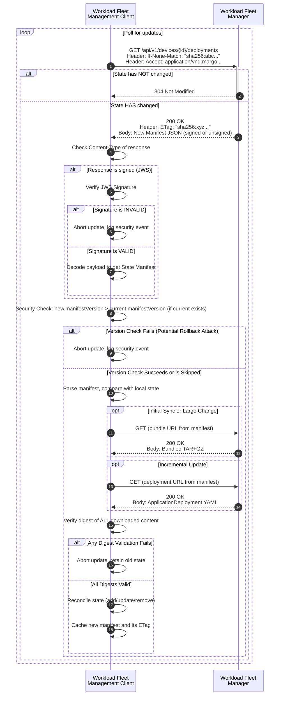

# Specification Update Proposal

## Owner

[@matlec](https://github.com/matlec)

## Summary

This proposal defines a standardized, pull-based protocol for a Margo-compliant **Workload Fleet Management Client** on an **Edge Compute Device** to retrieve its desired state from a **Workload Fleet Manager (WFM)**.

The protocol uses a REST/HTTP API where the client first fetches a lightweight **State Manifest**. This manifest lists all required [`ApplicationDeployment`](https://specification.margo.org/margo-api-reference/workload-api/desired-state-api/desired-state/)s, each identified by a unique `deploymentId`. The client then downloads only the necessary `ApplicationDeployment` YAML files. The protocol is designed to be highly efficient and resilient by using HTTP caching mechanisms ([`ETag`](https://datatracker.ietf.org/doc/html/rfc7232#section-2.3)) for incremental updates and an optional bundle for fast initial synchronization.

## Reason for proposal

The current Margo specification [implies a GitOps pattern for state distribution](https://specification.margo.org/fleet-management/workload/workload-deployment/) but does not define a formal, interoperable protocol for it. Following a decision by the Margo Technical Working Group (TWG) to move away from Git, this proposal defines a suitable replacement.

This SUP directly addresses the concerns raised by the TWG regarding the use of Git:

* **Git is an implementation, not a specification**: This proposal defines a clear API contract based on the universally adopted HTTP specification, which allows for compliance testing.
* **Dictating an implementation**: This proposal defines a protocol, giving vendors the freedom to choose their own implementation technologies for both the client and the WFM.
* **Storage overhead**: This artifact-based approach does not require storing the entire history of changes on the device, significantly reducing the storage footprint compared to a git repository.
* **Client overhead**: The protocol only requires a standard HTTP client, which is ubiquitous and lightweight, avoiding the need for a full git client on resource-constrained devices.
* **Protocol chattiness**: The `ETag` mechanism ensures that polling for updates is extremely efficient, involving minimal data transfer when no changes have occurred.

This SUP is needed to introduce a formal, lightweight, and secure protocol that:

* is firewall-friendly by operating over standard HTTPS (port 443)
* supports low-bandwidth and intermittent connectivity by minimizing data transfer and providing a clear sync path for offline clients
* has a low footprint, requiring only a minimal HTTP client
* decouples the specification from implementation by defining a clear API contract
* establishes a unified and co-located source of truth. The **State Manifest** and the **`ApplicationDeployment` documents** it references are all fetched from a consistent set of API endpoints on the same WFM. This creates a clear security and management boundary and simplifies the client's logic, cleanly separating the delivery of the desired state from the delivery of workload resources (like container images), which may be pulled from different servers or local registries.
* creates a consistent and symmetrical API. All client-WFM interactions, from pulling desired state (`GET`) to pushing status updates (`POST`), follow the same simple, RESTful pattern. This reduces implementation complexity on the client and ensures a coherent API for the entire Margo ecosystem.

## Requirements alignment acknowledgement

This proposal aligns with the core Margo vision of providing a standardized framework for application interoperability at the edge. It directly addresses the need for a scalable and efficient mechanism to distribute and manage workload configurations across a fleet of devices.

* **Applicable Features**: This SUP provides a concrete implementation path for the requirements outlined in issues [margo/specification#100](https://github.com/margo/specification/issues/100) and [margo/specification#101](https://github.com/margo/specification/issues/101).

**Authentication and authorization are considered out of scope for this proposal.** It is expected that these APIs will be protected by a common security mechanism defined elsewhere in the Margo specification.

## Technical proposal

All Margo-compliant clients and servers implementing this specification MUST support HTTP/1.1 as a baseline for interoperability. This ensures compatibility across a wide range of devices and network environments. Implementations MAY support and negotiate newer versions such as HTTP/2 or HTTP/3 for performance enhancements.

The proposed API is designed to be extensible. While this document focuses on workload deployments, the same manifest-based pattern and content-addressable bundles can be reused for future needs, such as distributing device-level configurations (e.g., via a new `/api/v1/devices/{deviceId}/configurations` endpoint). This ensures a consistent and evolvable API architecture.

The following sections describe the API endpoints and a typical workflow.

### API Endpoint Definitions

#### 1. Retrieve the State Manifest

The client polls this endpoint to retrieve the complete desired state for all workloads assigned to its identity.

* **Endpoint**: `GET /api/v1/devices/{deviceId}/deployments`

  | Parameter      | Type   | Required? | Description |
  | :------------- | :----- | :-------- | :---------- |
  | `{deviceId}` | string | Y | The unique identifier of the **Edge Compute Device** making the request |

* **Headers**:
  * `If-None-Match` (optional): The client **SHOULD** send the `ETag` value of its last successfully synced manifest.
  * `Accept` (optional): The client **SHOULD** send this header to indicate which manifest formats it supports, using the media types `application/vnd.margo.manifest.v1.jws+json` (signed) and/or `application/vnd.margo.manifest.v1+json` (unsigned). If this header is omitted, the server **MUST** respond with the `application/vnd.margo.manifest.v1+json` (unsigned) format.
* **Success Responses**:
  * **`200 OK`**: The body contains the manifest in a format negotiated by the client. The `Content-Type` header **MUST** indicate the format being returned (either `application/vnd.margo.manifest.v1+json` for unsigned, or `application/vnd.margo.manifest.v1.jws+json` for signed). The response also includes a new `ETag` header.
  * **`304 Not Modified`**: Returned if the `If-None-Match` ETag matches. The body is empty.
* **Failure Responses**:
  * **`406 Not Acceptable`**: This status code **MUST** be returned if the server cannot generate a response that matches any of the media types listed in the client's `Accept` header.

#### 2. Retrieve an Individual Workload Configuration

This endpoint is used by the client to fetch the YAML for a single `ApplicationDeployment` after it has processed a new State Manifest and identified a small number of new or updated deployments. This allows for highly efficient, incremental updates without needing to download the full bundle.

To make individual workload retrievals race-free and cache-friendly, this endpoint is **content-addressable**: the digest of the expected YAML is part of the URL. This guarantees immutability of the fetched resource and prevents a time-of-check / time-of-use race where a deployment changes between manifest retrieval and content fetch.

* **Endpoint**: `GET /api/v1/devices/{deviceId}/deployments/{deploymentId}/{digest}`

  | Parameter      | Type   | Required? | Description |
  | :------------- | :----- | :-------- | :---------- |
  | `{deviceId}` | string | Y | The unique identifier of the **Edge Compute Device** making the request |
  | `{deploymentId}` | string | Y | The unique UUID of the `ApplicationDeployment`, corresponding to the [`metadata.annotations.id`](https://specification.margo.org/margo-api-reference/workload-api/desired-state-api/desired-state/#annotations-attributes) field |
  | `{digest}` | string | Y | Content-addressable digest of the `ApplicationDeployment` YAML file. MUST conform to the [Digest Specification](#digest-specification) and MUST equal the digest computed over the exact sequence of bytes (per [Exact Bytes Rule](#digest-specification)) in the HTTP `200 OK` response body. If the server cannot produce content whose digest matches this value it MUST return `404 Not Found`. |

* **Success Response**:
  * **`200 OK`**: The response body is the raw `ApplicationDeployment` YAML file (`Content-Type: application/yaml`). The content **MUST** match the `{digest}` path segment; the server **MUST** return `404` if it does not have the exact digest referenced.

> [!IMPORTANT]
> A 404 Not Found response from this endpoint only indicates that the server does not have this specific, content-addressed version of the deployment. It MUST NOT be interpreted by the client as a signal to delete the workload. The sole source of truth for determining if a workload should be deleted is its absence from the [State Manifest](#manifest-formats-and-authenticity). Please refer to the [State Reconciliation](#state-reconciliation) section for further details.

> [!NOTE]
> Servers MAY offer compressed representations of the YAML payload using standard HTTP `Content-Encoding` (e.g., gzip, br). Clients SHOULD signal their ability to handle compressed content by sending the `Accept-Encoding` header in their request. The digest is always computed over the decoded representation (after decompression), per the [Exact Bytes Rule](#digest-specification).

> [!NOTE] Representation
> Only `application/yaml` is supported for individual `ApplicationDeployment` retrieval. A single canonical wire format ensures the digest uniquely identifies the exact bytes (per the [Exact Bytes Rule](#digest-specification)) without introducing canonicalization rules across formats (e.g. JSON vs YAML). Future extensions MAY introduce alternative media types, but each additional representation would require its own stable digest scope.

> [!IMPORTANT] Immutability & Caching
> This endpoint is content-addressable; the YAML is immutable. Servers set `ETag` to the quoted `digest` and SHOULD return `Cache-Control: public, max-age=31536000, immutable`. `If-None-Match` is optional for clients. Servers MAY apply `Content-Encoding` and SHOULD include `Vary: Accept-Encoding` if they do. Refer to the [ETag section](#etag-header) for details.

#### 3. Retrieve a Bundled Workload Configuration

The client fetches a bundle of all `ApplicationDeployment` YAMLs for efficient initial sync.

* **Endpoint**: `GET /api/v1/devices/{deviceId}/bundles/{digest}`

  | Parameter      | Type   | Required? | Description |
  | :------------- | :----- | :-------- | :---------- |
  | `{deviceId}` | string | Y | The unique identifier of the **Edge Compute Device** making the request |
  | `{digest}` | string | Y | Content-addressable digest of the bundle archive. MUST conform to the [Digest Specification](#digest-specification) and MUST equal the digest computed over the exact sequence of bytes (per [Exact Bytes Rule](#digest-specification)) in the HTTP `200 OK` response body. If the server cannot produce content whose digest matches this value it MUST return `404 Not Found`. |

* **Success Response**:
  * **`200 OK`**: The response body is the compressed archive with the `Content-Type` specified in the manifest's `bundle.mediaType`.

> [!IMPORTANT] Immutability & Caching
> This endpoint is content-addressable; the archive is immutable. Servers set `ETag` to the quoted `digest` and SHOULD return `Cache-Control: public, max-age=31536000, immutable`. Servers MAY apply `Content-Encoding` and SHOULD include `Vary: Accept-Encoding` if they do. `If-None-Match` is optional for clients. Refer to the [ETag section](#etag-header) for details.

### Key Concepts and Specifications

#### ETag Header

The `ETag` is a formal mechanism for cache validation.

* **Format**: The `ETag` value **MUST** be a string formatted as `"<algorithm>:<hex-encoded-hash>"`. The quotes are required per [RFC 7232](https://datatracker.ietf.org/doc/html/rfc7232#section-2.3).
  * Example: `ETag: "sha256:a1b2c3d4e5f6..."`
* **Rationale**: Using a **secure hash of the manifest content** guarantees that the ETag changes *if and only if* the desired state changes. This provides a stateless and perfectly reliable caching mechanism.
* **Computation Rule**: The manifest `ETag` **MUST** be the digest of the exact JSON response body of the manifest (after serialization). It is independent of any `bundle.digest` or individual deployment digests; it is a hash of the whole manifest document, not a field copy. Servers **SHOULD** serialize deterministically (stable field order, consistent key casing, no insignificant whitespace changes) to ensure consistent ETag generation. Clients MUST compare `If-None-Match` against this manifest ETag only.
* **Canonicalization Guidance**: The `ETag` value is a digest of the response body. To ensure this `ETag` is stable and that HTTP caching functions correctly, the server **MUST** serialize its JSON response bodies in a deterministic manner. For any given logical state, the exact sequence of bytes in the response body **MUST** be identical across all requests. This specification **RECOMMENDS** the use of the [JSON Canonicalization Scheme (JCS)](https://datatracker.ietf.org/doc/html/rfc8785) to fulfill this requirement.
* **Caching Rule (Mutable Manifest)**: The manifest endpoint MUST **NOT** be marked immutable. Servers SHOULD omit long-lived `Cache-Control: immutable` directives for the manifest and MAY use short `max-age` values (or none) because freshness is driven by `ETag` polling.

> Content-addressable resources: Any endpoint whose path embeds a digest (e.g. `/api/v1/devices/{deviceId}/bundles/{digest}` or `/api/v1/devices/{deviceId}/deployments/{deploymentId}/{digest}`) serves immutable content. The server **MUST** set `ETag` to the quoted digest and **SHOULD** include `Cache-Control: public, max-age=31536000, immutable`. Servers **MAY** apply HTTP `Content-Encoding` (e.g., gzip, br) and SHOULD include `Vary: Accept-Encoding` if they do. The digest always refers to the decoded representation (after decompression). This immutability guidance does **NOT** apply to the manifest endpoint, which is intentionally mutable. These ETags are strong validators (no `W/` prefix permitted).

#### Digest Specification

Digests are used to verify the integrity of all fetched content. The formal specification of the digest format ensures different client and WFM implementations can create and validate these integrity checks consistently, which is essential for interoperability.

* **Description**: The value of the digest is a string consisting of an algorithm portion and an encoded portion. The algorithm specifies the cryptographic hash function; the encoded portion contains the resulting hash.

* **Grammar**: A digest string **MUST** match the following grammar (ABNF subset):

  ```ebnf
  digest    = algorithm ":" encoded
  algorithm = 1*( ALPHA / DIGIT / "_" / "-" )   ; no colon allowed; MUST be lowercase
  encoded   = 1*HEXDIG                             ; MUST be lowercase hexadecimal
  ```

  * Example: In the digest string `sha256:a1b2c3d4e5f6...`, `sha256` is the (lowercase) algorithm and the `encoded` portion is a lowercase hex string. For `sha256` the encoded portion is exactly 64 lowercase hex characters (`[0-9a-f]{64}`).

* **Required Algorithm**: All conformant implementations **MUST** support `sha256`. For `sha256`, the `encoded` portion **MUST** be a lowercase hex string of length 64.
* **Unsupported Algorithm**: If a manifest references a digest with an unsupported algorithm, clients **MUST** treat the manifest as invalid and abort processing.

* **Validation**: Before using any fetched content, the client **MUST** calculate its digest and verify that it matches the one provided in the manifest. This step provides a defense-in-depth guarantee against data corruption during transit.
* **Exact Bytes Rule**: A digest always refers to the cryptographic hash of the exact sequence of bytes served in a successful `200 OK` response body for that resource (no reformatting, whitespace normalization, line-ending conversion, character set transcoding, compression differences, or YAML re-serialization). If `Content-Encoding` (e.g., gzip, br) is applied, the digest is computed over the decoded representation delivered to the application layer (after HTTP content-coding decompression). Servers and clients **MUST** adhere to this rule to ensure interoperability.

#### Manifest Formats and Authenticity

This specification defines two representations for the State Manifest: a simple unsigned JSON object and a highly secure, signed JWS object. The format served by the WFM is determined by HTTP Content Negotiation.

##### Format 1: Unsigned State Manifest

* **Media Type:** `application/vnd.margo.manifest.v1+json`

This format is a plain JSON object. While it provides integrity for linked artifacts via digests, the manifest itself is not signed and thus offers no guarantee of authenticity.

```json
{
  "manifestVersion": 101,
  "bundle": {
    "mediaType": "application/vnd.margo.bundle.v1+tar+gzip",
    "digest": "sha256:b5c6d7e8f9...",
    "url": "/api/v1/devices/northstarida.xtapro.k8s.edge/bundles/sha256:b5c6d7e8f9..."
  },
  "deployments": [
    {
      "deploymentId": "a3e2f5dc-912e-494f-8395-52cf3769bc06",
      "digest": "sha256:a4e01b2c3d...",
      "url": "/api/v1/devices/northstarida.xtapro.k8s.edge/deployments/a3e2f5dc-912e-494f-8395-52cf3769bc06/sha256:a4e01b2c3d..."
    }
  ]
}
```

| Field | Type | Required? | Description |
| :--- | :--- | :--- | :--- |
| `manifestVersion` | number | Y | Monotonically increasing unsigned 64-bit integer in the inclusive range `[1, 2^64-1]`. The WFM **MUST** ensure each new manifest for the same device has a strictly greater value than the previous. The first manifest **MUST** use `1`. Prevents rollback attacks. |
| `bundle` | object | N | Describes a single archive containing all `ApplicationDeployment` documents. If there are zero deployments (`deployments` array is empty) the property **MUST** be present with the value `null` (it MUST NOT be omitted). |
| `bundle.mediaType`| string | Y | MUST be `application/vnd.margo.bundle.v1+tar+gzip`; a gzip-compressed tar whose root contains **one or more** `ApplicationDeployment` YAML files. If there are zero deployments then `bundle` **MUST** be `null` (an empty archive MUST NOT be served). The archive MUST contain exactly the set of YAML files referenced by `deployments`. |
| `bundle.digest` | string | Y | The [digest](#digest-specification) of the bundle archive. MUST equal the digest computed over the exact sequence of bytes (per [Exact Bytes Rule](#digest-specification)) in the bundle endpoint's HTTP `200 OK` response body. |
| `bundle.sizeBytes` | number | N | Unsigned 64-bit **advisory estimate** of the decoded payload length in bytes for the bundle archive. Provided for bandwidth estimation and update planning. **MUST NOT** be used for integrity; digest verification remains mandatory. |
| `bundle.url` | string | Y | Content-addressable retrieval endpoint of the form `/api/v1/devices/{deviceId}/bundles/{digest}` where `{digest}` equals `bundle.digest`. |
| `deployments` | array | Y | A list of all deployment objects for the device |
| `deployments[].deploymentId`| string | Y | The unique UUID from the `ApplicationDeployment`'s [`metadata.annotations.id`](https://specification.margo.org/margo-api-reference/workload-api/desired-state-api/desired-state/#annotations-attributes) |
| `deployments[].digest` | string | Y | The [digest](#digest-specification) of the individual `ApplicationDeployment` YAML file. MUST equal the digest computed over the exact sequence of bytes (per [Exact Bytes Rule](#digest-specification)) in that deployment endpoint's HTTP `200 OK` response body. |
| `deployments[].sizeBytes` | number | N | Unsigned 64-bit **advisory estimate** of the decoded payload length in bytes for the deployment YAML. Provided for planning or progress display. **MUST NOT** be used for integrity; digest verification remains mandatory. |
| `deployments[].url` | string | Y | Content-addressable endpoint of the form `/api/v1/devices/{deviceId}/deployments/{deploymentId}/{digest}`. The `{digest}` **MUST** equal `deployments[].digest`; the referenced resource is immutable. |

> [!NOTE]
> Individual workload configurations are *implicitly versioned* by their digest. Any semantic change produces a new digest (and thus a new URL). Because the URL embeds the digest, these resources are immutable; no additional per-deployment version field is required. The `manifestVersion` counter is scoped per device and orders successive manifests for that device.

##### Format 2: Signed State Manifest (JWS)

* **Media Type:** `application/vnd.margo.manifest.v1.jws+json`

To guarantee authenticity and integrity, this format **MUST** be a **Flattened JWS JSON Serialization Object** as defined in [RFC 7515, Section 7.2.2](https://datatracker.ietf.org/doc/html/rfc7515#section-7.2.2). The [unsigned State Manifest](#format-1-unsigned-state-manifest) is the JWS `payload`.

```json
{
  "payload": "eyJtYW5pZmVzdFZlcnNpb24iOjEwMSwi...",
  "protected": "eyJhbGciOiJFUzI1NiJ9",
  "signature": "ad_db3AdL-8p...s-91Xz4thGg"
}
```

| Field | Type | Required? | Description |
| :--- | :--- | :--- | :--- |
| `payload` | string | Y | A Base64URL-encoded string of the [Unsigned State Manifest](#format-1-unsigned-state-manifest) |
| `protected`| string | Y | A Base64URL-encoded JSON object containing the signature algorithm (e.g., `{"alg":"ES256"}`) |
| `signature`| string | Y | A Base64URL-encoded string of the raw cryptographic signature |

##### Security Phasing and Content Negotiation

This specification defines a security model for manifest authenticity using JWS signatures. To facilitate rapid adoption and align with preview release timelines, this feature is being introduced with a phased implementation requirement.

* For preview release of the Margo specification:
  * A WFM server **MUST** support serving **unsigned** manifests. A server **SHOULD** also support serving **signed** manifests.
  * A WFM client **MUST** support processing **unsigned** manifests. A client **SHOULD** also support verifying **signed** manifests.

* For the Margo 1.0 Specification:
  * All compliant WFM servers and clients **MUST** support the signed manifest format and its verification

Clients **SHOULD** use HTTP Content Negotiation via the `Accept` header to signal their capabilities. A client that supports both formats should indicate its preference for the signed format using a higher quality value (`q`):

`Accept: application/vnd.margo.manifest.v1.jws+json, application/vnd.margo.manifest.v1+json;q=0.8`

##### Cryptographic Profile (for Signed Manifests)

* A WFM server **MUST** support signing manifests with [algorithms](https://datatracker.ietf.org/doc/html/rfc7518) based on both ECDSA with P-256 (`ES256`) and RSA with 3072+ bit keys (`RS256`)
* A WFM client **MUST** support verifying signatures for *at least one* of the server's mandatory-to-implement algorithms

##### Key Identification and Trust

A WFM client **MUST NOT** trust the `jwk` (JSON Web Key) or `jku` (JWK Set URL) JWS header parameters. The client **MUST** exclusively use public keys obtained through a secure, out-of-band mechanism. The specific mechanism for discovering and trusting the WFM's public signing keys is defined by the Margo security architecture and is outside the scope of this proposal.

### Typical Workflow and Client Behavior

1. A **Workload Fleet Management Client** polls the manifest endpoint (`GET /api/v1/devices/{deviceId}/deployments`) provided by the **Workload Fleet Manager** with its cached `ETag`
2. If it receives a `304 Not Modified` response, the process ends until the next poll cycle
3. If it receives a `200 OK` response with a new manifest:
    a.  **Security Check**: The client **MUST** inspect the `Content-Type` header of the response to determine the format of the manifest.
        - **If the manifest is signed** (`application/vnd.margo.manifest.v1.jws+json`), the client **MUST first** verify the JWS signature. If the signature is invalid, the update **MUST** be aborted. The client then decodes the `payload` to get the State Manifest object.
        - **If the manifest is unsigned** (`application/vnd.margo.manifest.v1+json`), the client proceeds with the raw JSON object.
    b.  **Version Check**: The client **MUST** perform a version check before proceeding. Let the newly received manifest be `new_manifest` and the locally stored version be `current_manifest_version`.
        - If the client has no previously stored `current_manifest_version` (e.g., on initial startup or after a state reset), this check is bypassed.
        - Otherwise, the client **MUST** verify that `new_manifest.manifestVersion > current_manifest_version`. If this condition is false, the client **MUST** reject the update, discard `new_manifest`, and SHOULD log a security event. The process stops.
    c.  **Content Fetch**: If the version check passes, the client determines the most efficient way to fetch content and downloads all required `ApplicationDeployment` YAMLs.
    d.  **Integrity Check**: The client **MUST** validate the digest of all downloaded content *before* proceeding. If any digest is invalid, the client **MUST** abort the update and retain its previous state. The optional `sizeBytes` fields are advisory only and **MUST NOT** be used for integrity validation.
    e.  **State Reconciliation**: Once all content is successfully fetched and validated, the client reconciles its current state with the desired state.
    f.  **Cache Update**: Upon successful reconciliation, the client **MUST** persist the `new_manifest` as its new local source of truth. This action replaces the previous manifest, thereby updating the `current_manifest_version` and the cached `ETag` that will be used in the next poll cycle.
    *The client **MUST** durably persist (e.g., non-volatile storage) the last accepted `manifestVersion` and associated `ETag` so that rollback protection remains effective across restarts.*

While the content fetching strategy is an implementation detail, clients SHOULD prefer downloading the bundle on initial sync and MAY choose to download the bundle if a large percentage of deployments have changed. For routine updates involving a small number of changes, fetching individual configurations is the most efficient method. When present, `sizeBytes` values may be used as advisory estimates to guide this choice.

#### State Reconciliation

The client is responsible for comparing the `new_manifest` to its **previously cached manifest** to determine the necessary actions.

* **Adding/Updating:** If a `deploymentId` in the manifest does not exist on the client, or if its `digest` differs from the client's current version, the client **MUST** apply the new `ApplicationDeployment`.
* **Deletion:** If a workload is running on the client but its `deploymentId` is not present in the new manifest's `deployments` array, the client **MUST** remove that workload.



> [!NOTE]
> To maintain readability, this diagram shows a simplified control flow. The normative text in step 6 (*"Abort update, log security event"*) **MUST** be followed: if signature verification fails, the update process **MUST** be aborted immediately, and no subsequent steps (like the version check) are performed.

### Security Considerations

This protocol incorporates several mechanisms to ensure a secure state distribution process.

* **Rollback Attack Prevention**: The protocol defends against rollback attacks by combining integrity with ordering. The `ETag` header (a content digest) lets the client detect that the state differs; the per-device, monotonically increasing `manifestVersion` lets it distinguish *newer* from merely *different*. A client **MUST** validate both and reject any manifest whose `manifestVersion` is not strictly greater than the last accepted value.
* **Data Integrity**: The integrity of all distributed content is verifiable. The manifest provides digests for both the optional bundle and each individual `ApplicationDeployment` file. Clients **MUST** validate these digests after download and before application to protect against data corruption during transit.
* **Authenticity (Signed Manifests)**: When the signed manifest format is used, the JWS signature provides a strong cryptographic guarantee of the manifest's authenticity and integrity, protecting against Man-in-the-Middle and other network attacks. It ensures the `manifestVersion` and all digests are from a trusted source.
* **Authentication and Authorization**: This specification intentionally omits authentication and authorization. It is expected that all API endpoints are protected by a robust security framework defined elsewhere in the Margo specification, such as mutual TLS (mTLS) for device identity and OAuth2 for access control.

## Alternatives considered (optional)

* **Git-based Protocol**: Rejected by the Margo TWG for reasons outlined [above](#reason-for-proposal)
* **OCI-based Protocol**: [Another SUP](https://github.com/margo/specification-enhancements/blob/desired_state_from_oci.wip/submitted/sup_desired_state_from_oci.md) details using the OCI distribution specification. This approach is powerful and leverages a rich ecosystem, but introduces higher protocol complexity. The choice between these proposals depends on Margo's strategic priority: the **simplicity and minimalism** of a purpose-built API (this proposal) versus the **ecosystem reuse** offered by OCI.
